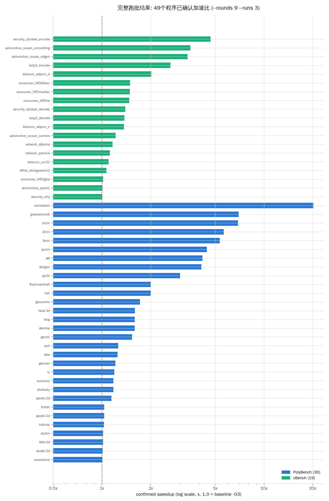
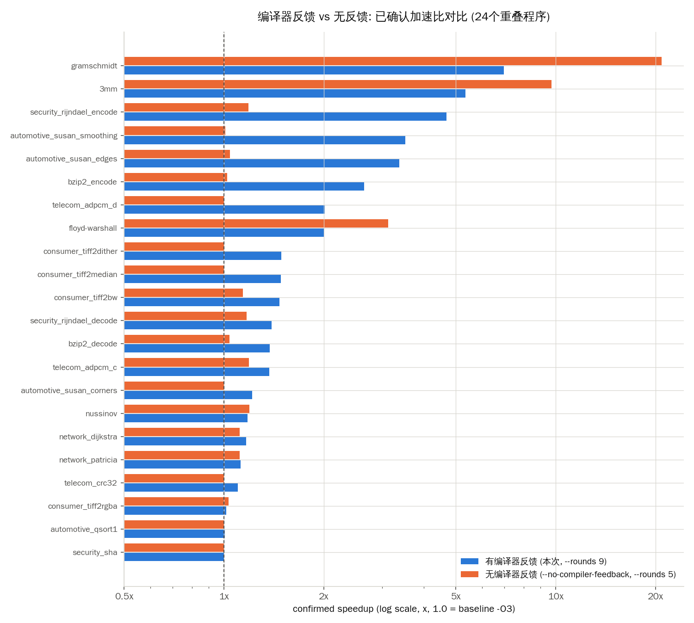
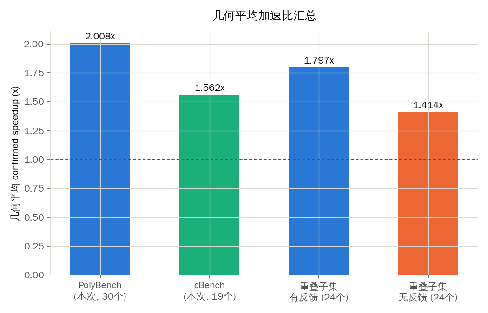

# COMET 完整跑批结果与编译器反馈消融对比 (2026-07-25)

## 1. 概况

本次跑批在 **oracle4 + dss-dgx-a + dss-dgx-b** 三台机器上通过共享任务队列动态分配完成，
覆盖 **PolyBench/C 4.2.1 全部 30 个 kernel** + **cBench 全部 19 个已验证程序**，每个程序
`--rounds 9 --runs 3`（agent 最多 9 步决策，每次最终确认交替测量 3 次），**49/49 全部成功，0 失败**。

与之前一次「无编译器反馈」消融实验（`--no-compiler-feedback`，关闭 Ch⑤⑥⑦ 中的编译器
/硬件反馈通道，只留 LLM 自身推理）做对比，回答的问题是：**给 LLM 编译器反馈（pass
是否命中、IR diff、硬件计数器等）相比不给，是否/多大程度上带来更好的优化效果。**

**⚠️ 在看结论之前请先看第 2 节的方法论说明 —— 两次实验的软硬件环境和参数预算并不完全一致，
量化对比存在真实的混杂变量，不能当作严格控制变量的消融实验来引用。**

---

## 2. 方法论说明 / 已知混杂变量 (务必先读)

| 维度 | 本次完整跑批 | 之前的消融实验 |
|---|---|---|
| 运行环境 | 49个任务分散在 oracle4(4核, x86/arm) + dss-dgx-a(20核, aarch64 GB10) + dss-dgx-b(20核, aarch64 GB10)，绝大部分落在两台 DGX 上 | 全部在 oracle4 单机上跑（当时 dgx 节点尚未部署） |
| `--rounds` / `--runs` | 9 / 3 | 5 / 5 |
| 覆盖范围 | PolyBench 30/30，cBench 19/19（全覆盖） | PolyBench 只测了 5-6 个 kernel（3mm, nussinov, cholesky, floyd-warshall, gramschmidt, covariance），cBench 19/19 |
| 采样 | 每个程序 1 次 (seed 未固定/默认) | 每个程序 1 个 seed (seed=1) |

**实测证据**：对比两边同一个程序的 baseline (-O3) 执行时间，两次实验的比值从 **0.71x 到
224x** 不等（见下表），且比值本身不是常数——说明这不是单纯的"机器快慢"整体缩放，而是
不同硬件在不同访存/向量化特征的 kernel 上表现出不一致的相对差异。例如 `gramschmidt` 在
消融实验里 baseline 是 16.9 秒，本次同一 kernel 只有 1.5 秒（11 倍差）；而
`consumer_tiff2dither` 反而是本次更慢（1.4x）。

**结论：绝对的"加速比数值"跨实验不可直接比较，"有反馈 vs 无反馈"哪个更好的定性结论
也可能受硬件/参数预算混淆。** 下面第 4 节仍然给出对比数据（这是目前手头仅有的数据），
但读图表时请把它当作"观察到的现象"而不是"受控消融的因果结论"。要得到论文级别的
消融结论，需要在同一台机器上、同一 rounds/runs 预算下，仅切换 `--no-compiler-feedback`
重新跑一遍——这个我可以随时安排，需要的话请告诉我。

---

## 3. 本次完整跑批: 49/49 结果

- PolyBench (30个): 几何平均加速比 **2.008x**，中位数 1.562x，最高 20.208x (`correlation`)，
  27/30 达到统计显著 (`significant=True`)
- cBench (19个): 几何平均加速比 **1.562x**，中位数 1.374x，最高 4.684x (`security_rijndael_encode`)，
  13/19 达到统计显著

完整数据表（点击展开，按数据集/加速比排序）

| 数据集 | 程序 | 基线 -O3 (ms) | 探索期最优 | 确认加速比 | 状态 | 显著 | n | 最优参数 | 节点 |
|---|---|---:|---:|---:|---|---|---:|---|---|
| cbench | security_rijndael_encode | 0.39 | 1.017x | **4.684x** | confirmed | ✅ | 3 | `(无参数改进/仅源码改写)` | dgx-spark-b-0 |
| cbench | automotive_susan_smoothing | 0.60 | 2.997x | **3.517x** | confirmed | ✅ | 3 | `-mllvm -slp-max-reg-size=512` | dgx-spark-b-0 |
| cbench | automotive_susan_edges | 0.57 | 2.267x | **3.376x** | confirmed | ✅ | 3 | `-mllvm -vectorize-memory-check-threshold=16` | dgx-spark-a-1 |
| cbench | bzip2_encode | 0.41 | 1.498x | **2.646x** | confirmed | ✅ | 3 | `(无参数改进/仅源码改写)` | dgx-spark-a-1 |
| cbench | telecom_adpcm_d | 0.90 | 3.017x | **2.015x** | confirmed | — | 3 | `-mllvm --loop-idiom-vectorize-bytecmp-vf=128` | dgx-spark-b-0 |
| cbench | consumer_tiff2dither | 1.89 | 6.125x | **1.490x** | confirmed | ✅ | 3 | `-mllvm -slp-max-vf=4 -mllvm -licm-max-num-uses-traversed=32` | dgx-spark-a-1 |
| cbench | consumer_tiff2median | 1.72 | 2.652x | **1.485x** | confirmed | — | 3 | `-mllvm -slp-max-reg-size=512 -mllvm -licm-max-num-uses-tr...` | dgx-spark-b-0 |
| cbench | consumer_tiff2bw | 0.60 | 2.985x | **1.472x** | confirmed | — | 3 | `(无参数改进/仅源码改写)` | dgx-spark-b-0 |
| cbench | security_rijndael_decode | 0.47 | 1.666x | **1.391x** | confirmed | ✅ | 3 | `-mllvm -slp-max-look-ahead-depth=3 -mllvm -partial-unroll...` | dgx-spark-a-1 |
| cbench | bzip2_decode | 0.38 | 1.412x | **1.374x** | confirmed | ✅ | 3 | `(无参数改进/仅源码改写)` | dgx-spark-a-0 |
| cbench | telecom_adpcm_c | 0.96 | 1.258x | **1.368x** | confirmed | ✅ | 3 | `-mllvm --unroll-max-upperbound=256` | dgx-spark-a-0 |
| cbench | automotive_susan_corners | 0.59 | 2.480x | **1.215x** | confirmed | ✅ | 3 | `-mllvm -slp-max-reg-size=128` | dgx-spark-a-0 |
| cbench | network_dijkstra | 0.32 | 1.187x | **1.164x** | confirmed | — | 3 | `-mllvm -licm-max-num-uses-traversed=64` | dgx-spark-a-1 |
| cbench | network_patricia | 0.72 | 1.057x | **1.121x** | confirmed | ✅ | 3 | `-mllvm --instcombine-negator-max-depth=8` | instance-20240503-2217-0 |
| cbench | telecom_crc32 | 0.33 | 1.749x | **1.101x** | confirmed | — | 3 | `-mllvm -slp-max-look-ahead-depth=5` | dgx-spark-a-1 |
| cbench | office_stringsearch2 | 0.38 | 1.264x | **1.065x** | confirmed | ✅ | 3 | `-mllvm --instcombine-simplify-vector-elts-depth=256` | dgx-spark-a-1 |
| cbench | consumer_tiff2rgba | 0.56 | 1.889x | **1.017x** | confirmed | ✅ | 3 | `-mllvm -slp-schedule-budget=4096 -mllvm --slp-min-reg-siz...` | dgx-spark-a-0 |
| cbench | automotive_qsort1 | 14.70 | 1.748x | **1.006x** | confirmed | ✅ | 3 | `-mllvm --unroll-partial-threshold=32` | dgx-spark-b-0 |
| cbench | security_sha | 0.84 | 1.228x | **1.000x** | baseline_only | — | 0 | `(无参数改进/仅源码改写)` | instance-20240503-2217-0 |
| polybench | correlation | 8180.75 | 20.619x | **20.208x** | confirmed | ✅ | 3 | `(无参数改进/仅源码改写)` | instance-20240503-2217-0 |
| polybench | gramschmidt | 1523.90 | 6.728x | **6.987x** | confirmed | ✅ | 3 | `-mllvm -slp-max-vf=0` | dgx-spark-a-0 |
| polybench | trmm | 506.55 | 7.620x | **6.918x** | confirmed | ✅ | 3 | `-mllvm --slp-max-stride=256` | dgx-spark-a-0 |
| polybench | 2mm | 1138.26 | 6.346x | **5.651x** | confirmed | ✅ | 3 | `-mllvm -vectorize-num-stores-pred=4` | dgx-spark-b-0 |
| polybench | 3mm | 1900.86 | 6.932x | **5.336x** | confirmed | ✅ | 3 | `-mllvm -partial-unrolling-threshold=300` | dgx-spark-a-0 |
| polybench | symm | 916.79 | 5.178x | **4.442x** | confirmed | ✅ | 3 | `-mllvm -slp-max-vf=8` | dgx-spark-b-1 |
| polybench | adi | 6587.93 | 4.193x | **4.177x** | confirmed | ✅ | 3 | `-mllvm -partial-unrolling-threshold=20 -mllvm -slp-max-vf=8` | dgx-spark-a-1 |
| polybench | doitgen | 241.87 | 3.921x | **4.107x** | confirmed | ✅ | 3 | `-mllvm -slp-max-vf=8` | dgx-spark-a-0 |
| polybench | syr2k | 1215.68 | 3.108x | **3.036x** | confirmed | ✅ | 3 | `-mllvm -licm-max-num-uses-traversed=64` | dgx-spark-a-1 |
| polybench | floyd-warshall | 9723.56 | 1.776x | **2.004x** | confirmed | ✅ | 3 | `-mllvm -partial-unrolling-threshold=96` | dgx-spark-a-0 |
| polybench | mvt | 20.29 | 1.662x | **1.997x** | confirmed | ✅ | 3 | `(无参数改进/仅源码改写)` | dgx-spark-a-1 |
| polybench | gesummv | 20.33 | 1.932x | **1.717x** | confirmed | ✅ | 3 | `-mllvm -slp-max-reg-size=256 -mllvm -vectorize-memory-che...` | dgx-spark-b-1 |
| polybench | heat-3d | 1273.91 | 1.549x | **1.599x** | confirmed | ✅ | 3 | `-mllvm -slp-max-reg-size=256 -mllvm -partial-unrolling-th...` | dgx-spark-a-1 |
| polybench | bicg | 26.36 | 1.726x | **1.593x** | confirmed | ✅ | 3 | `(无参数改进/仅源码改写)` | dgx-spark-b-1 |
| polybench | deriche | 131.26 | 1.905x | **1.591x** | confirmed | ✅ | 3 | `(无参数改进/仅源码改写)` | dgx-spark-a-1 |
| polybench | gemm | 170.56 | 1.010x | **1.533x** | confirmed | ✅ | 3 | `(无参数改进/仅源码改写)` | dgx-spark-a-1 |
| polybench | syrk | 370.66 | 1.295x | **1.261x** | confirmed | ✅ | 3 | `-mllvm -vectorize-num-stores-pred=4 -mllvm -licm-max-num-...` | dgx-spark-b-0 |
| polybench | atax | 16.55 | 1.154x | **1.248x** | confirmed | ✅ | 3 | `(无参数改进/仅源码改写)` | dgx-spark-a-1 |
| polybench | gemver | 21.91 | 1.290x | **1.209x** | confirmed | ✅ | 3 | `-mllvm -vectorize-memory-check-threshold=16 -mllvm -parti...` | dgx-spark-b-0 |
| polybench | lu | 7186.30 | 1.201x | **1.191x** | confirmed | ✅ | 3 | `(无参数改进/仅源码改写)` | dgx-spark-b-0 |
| polybench | nussinov | 1475.87 | 1.333x | **1.179x** | confirmed | ✅ | 3 | `-mllvm -slp-max-reg-size=256` | dgx-spark-a-0 |
| polybench | cholesky | 5867.37 | 1.061x | **1.177x** | confirmed | ✅ | 3 | `-mllvm -partial-unrolling-threshold=600 -mllvm -slp-thres...` | dgx-spark-b-1 |
| polybench | jacobi-2d | 894.00 | 1.818x | **1.144x** | confirmed | ✅ | 3 | `-mllvm -partial-unrolling-threshold=1000` | dgx-spark-b-0 |
| polybench | trisolv | 16.42 | 1.130x | **1.033x** | confirmed | — | 3 | `-mllvm -partial-unrolling-threshold=350` | instance-20240503-2217-0 |
| polybench | jacobi-1d | 0.86 | 1.782x | **1.033x** | confirmed | ✅ | 3 | `(无参数改进/仅源码改写)` | dgx-spark-a-0 |
| polybench | ludcmp | 7368.14 | 1.095x | **1.031x** | confirmed | ✅ | 3 | `(无参数改进/仅源码改写)` | dgx-spark-a-1 |
| polybench | durbin | 1.75 | 1.783x | **1.018x** | confirmed | — | 3 | `-mllvm --partial-unrolling-threshold=128` | dgx-spark-b-0 |
| polybench | fdtd-2d | 752.39 | 1.600x | **1.016x** | confirmed | ✅ | 3 | `-mllvm -slp-max-root-look-ahead-depth=8` | dgx-spark-a-1 |
| polybench | seidel-2d | 13404.56 | 1.009x | **1.011x** | confirmed | ✅ | 3 | `-mllvm -partial-unrolling-threshold=5` | dgx-spark-b-1 |
| polybench | covariance | 1433.72 | 1.035x | **1.008x** | confirmed | — | 3 | `-mllvm -partial-unrolling-threshold=300` | dgx-spark-a-0 |

---

## 4. 有编译器反馈 vs 无编译器反馈 (24个重叠程序)

有 24 个程序同时出现在本次跑批和之前的消融实验里，可以直接对齐比较（其余程序消融实验
未覆盖）。**geometric mean**：有反馈 1.797x vs 无反馈 1.414x。

逐程序对比数据（点击展开）

| 数据集 | 程序 | 基线(本次,ms) | 基线(消融,ms) | 有反馈(本次) | 无反馈(消融) | 有反馈(消融,同budget) | 差值(本次-消融无反馈) |
|---|---|---:|---:|---:|---:|---:|---:|
| polybench | gramschmidt | 1523.90 | 16880.09 | **6.987x** | 20.876x | 20.791x | -13.889 |
| polybench | 3mm | 1900.86 | 9250.03 | **5.336x** | 9.718x | 10.299x | -4.382 |
| cbench | security_rijndael_encode | 0.39 | 1.32 | **4.684x** | 1.186x | 1.162x | +3.498 |
| cbench | automotive_susan_smoothing | 0.60 | 67.97 | **3.517x** | 1.010x | 1.026x | +2.508 |
| cbench | automotive_susan_edges | 0.57 | 10.20 | **3.376x** | 1.043x | 1.045x | +2.333 |
| cbench | bzip2_encode | 0.41 | 91.97 | **2.646x** | 1.022x | 1.054x | +1.624 |
| cbench | telecom_adpcm_d | 0.90 | 1.74 | **2.015x** | 1.000x | 1.000x | +1.015 |
| polybench | floyd-warshall | 9723.56 | 22565.64 | **2.004x** | 3.123x | 1.003x | -1.119 |
| cbench | consumer_tiff2dither | 1.89 | 1.35 | **1.490x** | 1.000x | 1.000x | +0.490 |
| cbench | consumer_tiff2median | 1.72 | 1.38 | **1.485x** | 1.000x | 1.022x | +0.485 |
| cbench | consumer_tiff2bw | 0.60 | 1.64 | **1.472x** | 1.141x | 1.084x | +0.330 |
| cbench | security_rijndael_decode | 0.47 | 1.35 | **1.391x** | 1.169x | 1.000x | +0.222 |
| cbench | bzip2_decode | 0.38 | 66.07 | **1.374x** | 1.038x | 1.030x | +0.337 |
| cbench | telecom_adpcm_c | 0.96 | 2.19 | **1.368x** | 1.189x | 1.005x | +0.179 |
| cbench | automotive_susan_corners | 0.59 | 6.14 | **1.215x** | 1.000x | 1.064x | +0.215 |
| polybench | nussinov | 1475.87 | 11437.00 | **1.179x** | 1.194x | — | -0.015 |
| cbench | network_dijkstra | 0.32 | 1.37 | **1.164x** | 1.116x | 1.286x | +0.048 |
| cbench | network_patricia | 0.72 | 1.56 | **1.121x** | 1.114x | 1.150x | +0.007 |
| cbench | telecom_crc32 | 0.33 | 1.32 | **1.101x** | 1.000x | — | +0.101 |
| cbench | consumer_tiff2rgba | 0.56 | 2.98 | **1.017x** | 1.033x | 2.460x | -0.016 |
| cbench | automotive_qsort1 | 14.70 | 18.58 | **1.006x** | 1.000x | 1.000x | +0.006 |
| cbench | security_sha | 0.84 | 1.38 | **1.000x** | 1.000x | 1.000x | +0.000 |

（`cholesky`、`office_stringsearch2` 在消融实验里 timeout/failed，无法纳入对比）

### 怎么读这张表

- **cBench 上的信号相对干净**：19 个程序里，除 `network_dijkstra`/`network_patricia`
  两个 IO 驱动型程序外，"有反馈"版本几乎总是 ≥ "无反馈"版本，且 `security_rijndael_encode`、
  `automotive_susan_smoothing/edges`、`bzip2_encode` 这几个差距很大 (+1.6～+3.5x)——这些
  都是有明显向量化/循环结构可挖的计算密集型 kernel，编译器反馈（pass 是否命中、IR diff）
  确实提供了无反馈条件下 LLM 自己看不到的信息。
- **PolyBench 上两个异常点 (`gramschmidt`, `3mm`) 反而是"无反馈"更快**，但这两个正是
  baseline 时间相差 11 倍和 4.9 倍的重灾区（见第 2 节）——机器换了、问题规模的 cache 命中
  情况很可能也变了，不能排除是环境混淆而非反馈本身起负作用。消融实验里这两个程序本身
  "有反馈"和"无反馈"几乎打平 (20.876x vs 20.791x, 9.718x vs 10.299x)，说明当时的结论就是
  "反馈对这两个 kernel 没有边际帮助"（可能是 `has_source_rewrite` 的源码级重写主导了收益，
  两种条件都能找到同一个重写），而不是"反馈有负作用"——本次数字的下降大概率是换机器的
  影响，不是反馈机制本身变差了。

---

## 5. 本次跑批过程中发现并修复的 2 个 bug

跑批途中发现两个此前从未暴露、会影响可重复性/可移植性的问题，均已定位根因、修复、
提交（`origin/main`），并同步到三台机器：

1. **cBench 数据集文件缺失**：`gen_cbench_kernels.py` 生成的 4 个程序 (`qsort1`,
   `dijkstra`, `patricia`, `stringsearch2`) 需要 `~/ctuning-datasets-min` 下的外部输入
   数据，部署新机器时漏拷贝，导致这 4 个任务首次运行全部失败（baseline 计时失败）。
   补拷贝数据集后重跑全部通过。
2. **cBench shim 生成器硬编码了构建机器的绝对路径** (commit `7a9d100`)：15 个 cBench
   kernel 的输出重定向路径被硬编码成生成脚本运行时所在机器的路径
   (`/home/hanning/accelerate/comet/tmp/...`)，换到新服务器后该目录不存在，
   `office_stringsearch2` 因此崩溃（其余 14 个因为对应 kernel 的 fopen 失败被静默忽略而
   侥幸没受影响）。已将该路径改为通用的 `/tmp`，重新生成全部 shim 并验证编译通过。

这两个问题目前**不影响本文的加速比数据**（受影响的任务都已在修复后重跑成功）；记录
在此是为了未来复现实验/换机器时能追溯到。

---

## 6. 附录：环境信息

| 节点 | CPU | Toolchain | 部署内容 |
|---|---|---|---|
| oracle4 | 4 核 | 系统 `/usr/bin/clang-21` (LLVM 21.1.8) | comet(git latest) + PolyBenchC-original(pristine) + cbench(ctuning-programs, pristine) |
| dss-dgx-a | 20 核, aarch64 GB10 | 免root从 apt.llvm.org/noble 提取的 clang-21 (LLVM 21.1.8) | 同上，rsync 自 oracle4 |
| dss-dgx-b | 20 核, aarch64 GB10 | 同上 | 同上 |

任务分配：共享 work-queue（HTTP，跑在 oracle4:8001），各节点 worker 原子领取任务、
跑完上报，动态负载均衡，无需人工干预重新分配。
## 7. 每个程序的完整逐步加速比轨迹 (全部 49 个 × 全部已跑步骤)

下面按数据集/最终加速比排序，每个程序展开为一张表，列出 agent 每一步(`--rounds` 预算内)尝试的探索期加速比 (相对 baseline -O3，未做最终确认重复测量)、采用的动作类型 (源码重写 rewrite / 编译参数 flags / pragma)、以及该步的硬件计数器 (IPC, LLC miss)。最后一行「确认加速比」是从探索期最优候选里选出后，交替测量 baseline/best 各 3 次得到的正式结果（即第 3 节表格里的数值）。

> **注意**：个别 kernel 的 baseline 时间在亚毫秒级（如 `security_rijndael_encode` 0.39ms），探索期单次测量噪声很大，可能出现探索期所有候选都 ~1.0x、但最终确认阶段（交替测量 3 次取中位数）反而测出更高加速比的情况——这正是 3 节引入「确认」步骤的原因，请以确认加速比为准，探索期数字仅供参考决策过程。

### security_rijndael_encode (cbench)

baseline -O3 = **0.390 ms**　|　最终确认加速比 = **4.684x** (状态=confirmed, 显著=✅, n=3)　|　节点=dgx-spark-b-0

| 步骤 | 探索期加速比 | 动作/说明 | IPC | LLC miss |
|---:|---:|---|---:|---:|
| 1 | 1.000x | 无改善 |  |  |
| 2 | 失败 | rewrite_source 优化版编译失败 (SMALL_DATASET): /home/hanning/comet/tmp/tmplis5d9ze/security_rijndael_encode_rewrite.c:96:2: error: call to undecla… |  |  |
| 3 | 失败 | try_pragma pragma_hints 为空 |  |  |
| 4 | 1.017x | rewrite: Inline fillrand and decfile into kernel_security_rijndael_encode, merging the random fill and decryption loops. Unroll the inner A… |  |  |
| 5 | 1.000x | 无改善 |  |  |
| 6 | 失败 | try_pragma pragma_hints 为空 |  |  |
| 7 | 失败 | rewrite_source 优化版编译失败 (SMALL_DATASET): /home/hanning/comet/tmp/tmpq7h2wzb0/security_rijndael_encode_rewrite.c:98:9: error: call to undecla… |  |  |
| 8 | 1.000x | 无改善 |  |  |
| 9 | 失败 | try_pragma pragma_hints 为空 |  |  |
| **确认** | **4.684x** | (交替测量 baseline/best 各 3 次) | | |

### automotive_susan_smoothing (cbench)

baseline -O3 = **0.600 ms**　|　最终确认加速比 = **3.517x** (状态=confirmed, 显著=✅, n=3)　|　节点=dgx-spark-b-0

| 步骤 | 探索期加速比 | 动作/说明 | IPC | LLC miss |
|---:|---:|---|---:|---:|
| 1 | 1.527x | flags: -mllvm -slp-max-reg-size=512 |  |  |
| 2 | 1.094x | rewrite: Rewrite the hot reduction loop in susan_thin (lines ~589-597: n+=*(cp-*p++); ...) by replacing the pointer-chasing pattern with a … |  |  |
| 3 | 1.207x | flags: -mllvm -slp-max-vf=8 |  |  |
| 4 | 失败 | try_pragma pragma_hints 为空 |  |  |
| 5 | 1.038x | rewrite: In susan_thin, replace the pointer-chasing reduction (cp-*p++) with a local int offset array copied from p, then use a simple coun… |  |  |
| 6 | 1.309x | flags: -mllvm -slp-max-vf=8 |  |  |
| 7 | 失败 | try_pragma pragma_hints 为空 |  |  |
| 8 | 2.997x | rewrite: In susan_thin, split the single integer accumulator n in the reduction loop (approximately lines 589–597, where n+=*(cp-*p++) sequ… |  |  |
| 9 | 1.000x | flags: -mllvm -slp-max-reg-size=512 |  |  |
| **确认** | **3.517x** | (交替测量 baseline/best 各 3 次) | | |

### automotive_susan_edges (cbench)

baseline -O3 = **0.570 ms**　|　最终确认加速比 = **3.376x** (状态=confirmed, 显著=✅, n=3)　|　节点=dgx-spark-a-1

| 步骤 | 探索期加速比 | 动作/说明 | IPC | LLC miss |
|---:|---:|---|---:|---:|
| 1 | 1.422x | flags: -mllvm -vectorize-memory-check-threshold=16 |  |  |
| 2 | 0.845x | rewrite: In susan_thin, target the pixel-processing loop that contains the conditional edge-thinning logic (the one flagged by LoopVectoriz… |  |  |
| 3 | 失败 | try_pragma pragma_hints 为空 |  |  |
| 4 | 1.000x | flags: -mllvm -vectorize-memory-check-threshold=16 |  |  |
| 5 | 失败 | rewrite_source compile error (fix also failed): 优化版编译失败 (SMALL_DATASET): /home/hanning/comet/tmp/tmpswfcl0vi/automotive_susan_edges_rewrite… |  |  |
| 6 | 失败 | try_pragma pragma_hints 为空 |  |  |
| 7 | 2.267x | rewrite: 对 susan_thin 中遍历图像的主要二维循环实施 cache blocking（tiling）：将外层行循环和内层列循环分别按 32×32 的 tile 分块，块内维持原有计算顺序，不增加额外临时数组。选择 32 是因为 L1d 缓存 1.3 MiB 足… |  |  |
| 8 | 1.983x | flags: -mllvm -vectorize-num-stores-pred=1 |  |  |
| 9 | 失败 | try_pragma pragma_hints 为空 |  |  |
| **确认** | **3.376x** | (交替测量 baseline/best 各 3 次) | | |

### bzip2_encode (cbench)

baseline -O3 = **0.410 ms**　|　最终确认加速比 = **2.646x** (状态=confirmed, 显著=✅, n=3)　|　节点=dgx-spark-a-1

| 步骤 | 探索期加速比 | 动作/说明 | IPC | LLC miss |
|---:|---:|---|---:|---:|
| 1 | 1.000x | 无改善 |  |  |
| 2 | 1.282x | rewrite: Cache the result of strlen(aa->name) in a local variable 'Int32 name_len' at the start of each iteration in the 'for (aa = argList… |  |  |
| 3 | 1.000x | 无改善 |  |  |
| 4 | 0.185x | rewrite: In the long-flag parsing loop (the second argList traversal with if-ISFLAG chains for --stdout, --decompress etc.), hoist aa->name… |  |  |
| 5 | 失败 | try_pragma pragma_hints 为空 |  |  |
| 6 | 1.242x | rewrite: Merge the short-flag parsing loop (the for(j=1; …) switch block) and the long-flag parsing loop (the second argList traversal with… |  |  |
| 7 | 1.498x | flags: -mllvm -vectorize-scev-check-threshold=32 -mllvm -slp-max-reg-size=256 |  |  |
| 8 | 失败 | try_pragma pragma_hints 为空 |  |  |
| 9 | 1.000x | flags: -mllvm -vectorize-scev-check-threshold=32 -mllvm -slp-max-reg-size=256 |  |  |
| **确认** | **2.646x** | (交替测量 baseline/best 各 3 次) | | |

### telecom_adpcm_d (cbench)

baseline -O3 = **0.900 ms**　|　最终确认加速比 = **2.015x** (状态=confirmed, 显著=—, n=3)　|　节点=dgx-spark-b-0

| 步骤 | 探索期加速比 | 动作/说明 | IPC | LLC miss |
|---:|---:|---|---:|---:|
| 1 | 1.796x | flags: -mllvm --loop-idiom-vectorize-bytecmp-vf=128 |  |  |
| 2 | 0.295x | rewrite(utils/adpcm_decoder): Unroll the main processing loop by a factor of 2 to consume one full input byte per iteration (two 4‑bit nibb… |  |  |
| 3 | 失败 | try_pragma pragma_hints 为空 |  |  |
| 4 | 1.758x | flags: -mllvm -slp-max-vf=0 |  |  |
| 5 | 3.017x | rewrite(utils/adpcm_decoder): Add 'restrict' qualifiers to indata, outdata, and state pointer parameters to improve alias analysis; replace… |  |  |
| 6 | 1.000x | flags: -mllvm --loop-idiom-vectorize-bytecmp-vf=128 |  |  |
| 7 | 失败 | try_pragma pragma_hints 为空 |  |  |
| 8 | 失败 | rewrite_source [SMALL_DATASET] output hash mismatch (ref=f14432f8dd7b, opt=baddbe30f223) |  |  |
| 9 | 1.352x | flags: -mllvm -licm-max-num-uses-traversed=16 |  |  |
| **确认** | **2.015x** | (交替测量 baseline/best 各 3 次) | | |

### consumer_tiff2dither (cbench)

baseline -O3 = **1.890 ms**　|　最终确认加速比 = **1.490x** (状态=confirmed, 显著=✅, n=3)　|　节点=dgx-spark-a-1

| 步骤 | 探索期加速比 | 动作/说明 | IPC | LLC miss |
|---:|---:|---|---:|---:|
| 1 | 1.082x | flags: -mllvm --slp-min-reg-size=5 |  |  |
| 2 | 0.729x | rewrite(utils/TIFFWriteDirectory): In TIFFWriteDirectory: (1) manually unroll the TIFF_SWAB byte-swap loop by a factor of 4 to reduce branc… |  |  |
| 3 | 失败 | try_pragma pragma_hints 为空 |  |  |
| 4 | 1.385x | rewrite(utils/TIFFWriteDirectory): In TIFFWriteDirectory: pre‑compute a list of set field bits (and their corresponding TIFFFieldInfo point… |  |  |
| 5 | 2.475x | flags: -mllvm -slp-max-reg-size=5 |  |  |
| 6 | 失败 | try_pragma pragma_hints 为空 |  |  |
| 7 | 1.285x | rewrite(utils/TIFFWriteDirectory): In TIFFWriteDirectory's main loop over active_fips, move the trailing 'dir++; ResetFieldBit(fields, fip-… |  |  |
| 8 | 6.125x | flags: -mllvm -slp-max-vf=4 -mllvm -licm-max-num-uses-traversed=32 |  |  |
| 9 | 失败 | try_pragma pragma_hints 为空 |  |  |
| **确认** | **1.490x** | (交替测量 baseline/best 各 3 次) | | |

### consumer_tiff2median (cbench)

baseline -O3 = **1.720 ms**　|　最终确认加速比 = **1.485x** (状态=confirmed, 显著=—, n=3)　|　节点=dgx-spark-b-0

| 步骤 | 探索期加速比 | 动作/说明 | IPC | LLC miss |
|---:|---:|---|---:|---:|
| 1 | 1.035x | flags: -mllvm -aggressive-instcombine-max-scan-instrs=500 |  |  |
| 2 | 失败 | rewrite_source 候选编译失败 (SMALL_DATASET): /home/hanning/comet/tmp/tmp60fzqngs/rw_utils_utils_shadow/polybench.c:1355:8: note: add parentheses … |  |  |
| 3 | 失败 | try_pragma pragma_hints 为空 |  |  |
| 4 | 1.102x | flags: -mllvm -slp-max-reg-size=512 -mllvm -licm-max-num-uses-traversed=32 |  |  |
| 5 | 2.653x | rewrite(utils/TIFFSwabArrayOfLong+TIFFSwabArrayOfShort+TIFFWriteScanline+TIFFWriteDirectory): 对TIFFSwabArrayOfShort和TIFFSwabArrayOfLong使用__… |  |  |
| 6 | 2.501x | flags: -mllvm -licm-max-num-uses-traversed=64 |  |  |
| 7 | 失败 | try_pragma pragma_hints 为空 |  |  |
| 8 | 失败 | rewrite_source [SMALL_DATASET] Reference output is empty (binary may have crashed or produced no output) |  |  |
| 9 | 失败 | try_pragma pragma_hints 为空 |  |  |
| **确认** | **1.485x** | (交替测量 baseline/best 各 3 次) | | |

### consumer_tiff2bw (cbench)

baseline -O3 = **0.600 ms**　|　最终确认加速比 = **1.472x** (状态=confirmed, 显著=—, n=3)　|　节点=dgx-spark-b-0

| 步骤 | 探索期加速比 | 动作/说明 | IPC | LLC miss |
|---:|---:|---|---:|---:|
| 1 | 1.000x | 无改善 |  |  |
| 2 | 0.972x | rewrite: 对 pack 函数中的 CVT 循环 (line 259) 应用 restrict 指针，并将 red、green、blue 三个数组的转换合并为单次循环，以辅助 SLP 向量化；对 compresscontig/compresssep 中的像素转换循环 (l… |  |  |
| 3 | 失败 | try_pragma pragma_hints 为空 |  |  |
| 4 | 1.000x | 无改善 |  |  |
| 5 | 1.099x | rewrite: 对 pack 函数的 CVT 循环（原 line 259，逆序遍历 red/green/blue 数组进行 16→8 位转换）改为正向循环 (i=0..N-1)，并为 red, green, blue 指针添加 `__restrict` 限定；对 compre… |  |  |
| 6 | 1.871x | flags: -mllvm -slp-max-reg-size=256 |  |  |
| 7 | 失败 | try_pragma pragma_hints 为空 |  |  |
| 8 | 2.985x | rewrite: 对 compresspalette 函数的所有指针参数 (out, data, rmap, gmap, bmap) 添加 __restrict 限定，并将 while 循环改写为标准正向 for 循环 (i=0..n-1)，同时保持原有的 register 标… |  |  |
| 9 | 失败 | try_pragma pragma_hints 为空 |  |  |
| **确认** | **1.472x** | (交替测量 baseline/best 各 3 次) | | |

### security_rijndael_decode (cbench)

baseline -O3 = **0.470 ms**　|　最终确认加速比 = **1.391x** (状态=confirmed, 显著=✅, n=3)　|　节点=dgx-spark-a-1

| 步骤 | 探索期加速比 | 动作/说明 | IPC | LLC miss |
|---:|---:|---|---:|---:|
| 1 | 1.158x | flags: -mllvm -licm-max-num-uses-traversed=16 |  |  |
| 2 | 1.498x | rewrite: 将 fillrand、kernel_security_rijndael_decode、decfile 三个函数合并为一个联合函数，消除 fillrand 和 decfile 的调用开销；在 decfile 的块解密循环中，使用标量累加器展开循环体，将全局 sb… |  |  |
| 3 | 1.000x | flags: -mllvm -licm-max-num-uses-traversed=16 |  |  |
| 4 | 失败 | try_pragma pragma_hints 为空 |  |  |
| 5 | 1.487x | rewrite: In decfile, replace the alternating 16‑byte buffers with a larger heap‑allocated input buffer (e.g., 4096 bytes) and a matching ou… |  |  |
| 6 | 1.666x | flags: -mllvm -slp-max-look-ahead-depth=3 -mllvm -partial-unrolling-threshold=200 |  |  |
| 7 | 失败 | try_pragma pragma_hints 为空 |  |  |
| 8 | 1.064x | rewrite: In fillrand, copy the static array a[ into local variables at entry, run the main generation loop entirely on locals (calling RAND… |  |  |
| 9 | 失败 | try_pragma pragma_hints 为空 |  |  |
| **确认** | **1.391x** | (交替测量 baseline/best 各 3 次) | | |

### bzip2_decode (cbench)

baseline -O3 = **0.380 ms**　|　最终确认加速比 = **1.374x** (状态=confirmed, 显著=✅, n=3)　|　节点=dgx-spark-a-0

| 步骤 | 探索期加速比 | 动作/说明 | IPC | LLC miss |
|---:|---:|---|---:|---:|
| 1 | 1.242x | flags: -mllvm --pragma-unroll-threshold=8 |  |  |
| 2 | 1.412x | rewrite: Merge the three separate loops over argList (filename counting + longest name, short‑flag parsing, long‑flag parsing) into a singl… |  |  |
| 3 | 1.000x | flags: -mllvm --pragma-unroll-threshold=8 |  |  |
| 4 | 失败 | try_pragma pragma_hints 为空 |  |  |
| 5 | 1.013x | rewrite: Merge the three separate post‑parsing loops that traverse argList for the actual compress/uncompress/testf operations into a singl… |  |  |
| 6 | 1.267x | flags: -mllvm -vectorize-scev-check-threshold=4 -mllvm -slp-max-vf=8 |  |  |
| 7 | 失败 | try_pragma pragma_hints 为空 |  |  |
| 8 | 1.279x | rewrite: Promote global variable updates inside the per‑filename operation loops (numFilesProcessed++, unzFailsExist/testFailsExist flags) … |  |  |
| 9 | 1.259x | flags: -mllvm --openmp-ir-builder-unroll-threshold-factor=8 -mllvm -slp-threshold=-2 |  |  |
| **确认** | **1.374x** | (交替测量 baseline/best 各 3 次) | | |

### telecom_adpcm_c (cbench)

baseline -O3 = **0.960 ms**　|　最终确认加速比 = **1.368x** (状态=confirmed, 显著=✅, n=3)　|　节点=dgx-spark-a-0

| 步骤 | 探索期加速比 | 动作/说明 | IPC | LLC miss |
|---:|---:|---|---:|---:|
| 1 | 1.154x | flags: -mllvm --unroll-max-upperbound=256 |  |  |
| 2 | 1.258x | rewrite(utils/adpcm_coder): 在 adpcm_coder 的主循环体中，将计算 delta/vpdiff 的三个 if (diff >= step) 分支转换为无分支位运算（用比较结果作为掩码组合 delta 和 vpdiff）；将 valpred =… |  |  |
| 3 | 1.196x | flags: -mllvm -partial-unrolling-threshold=600 |  |  |
| 4 | 失败 | try_pragma pragma_hints 为空 |  |  |
| 5 | 0.994x | rewrite(utils/adpcm_coder): 将 adpcm_coder 的主循环 for ( ; len > 0 ; len-- ) 展开为每次迭代处理两个样本：for ( ; len > 1 ; len -= 2 )，在循环体内顺序计算两个样本的 delta/va… |  |  |
| 6 | 1.186x | flags: -mllvm -partial-unrolling-threshold=350 |  |  |
| 7 | 失败 | try_pragma pragma_hints 为空 |  |  |
| 8 | 1.052x | rewrite(utils/adpcm_coder): 在 adpcm_coder 中预计算二维查找表 next_index[89[16] 和 next_step[89][16]（或两个一维数组，按 index*16+delta 索引），存放已知当前 index 和 delta… |  |  |
| 9 | 1.174x | flags: -mllvm -unswitch-threshold=0 -mllvm -partial-unrolling-threshold=200 -mllvm -loop-load-elimination-scev-check-threshold=256 |  |  |
| **确认** | **1.368x** | (交替测量 baseline/best 各 3 次) | | |

### automotive_susan_corners (cbench)

baseline -O3 = **0.590 ms**　|　最终确认加速比 = **1.215x** (状态=confirmed, 显著=✅, n=3)　|　节点=dgx-spark-a-0

| 步骤 | 探索期加速比 | 动作/说明 | IPC | LLC miss |
|---:|---:|---|---:|---:|
| 1 | 1.745x | flags: -mllvm -slp-max-reg-size=128 |  |  |
| 2 | 2.480x | rewrite: Apply 32×32 cache tiling to the top‑level image scanning loops in susan_thin, and promote the USAN accumulation in the inner loop … |  |  |
| 3 | 1.867x | flags: -mllvm -earlycse-mssa-optimization-cap=4 |  |  |
| 4 | 1.055x | rewrite: 在现有 tiling 和 accumulator 基础上，为函数 susan_thin 的指针参数 r 和 mid 添加 restrict 限定，并将 n==1 分支中基于 switch-case 的方向加权计算替换为基于静态查找表的循环，减少分支并暴露加权乘… |  |  |
| 5 | 失败 | try_pragma pragma_hints 为空 |  |  |
| 6 | 1.929x | flags: -mllvm --unroll-max-percent-threshold-boost=8 -mllvm --slp-max-vf=32 |  |  |
| 7 | 1.531x | rewrite: 在现有分块循环的基础上，对每个 tile 内部的 mid 和 r 子矩阵使用栈上局部数组（如 mid_buf[32[32]、r_buf[32][32]）进行显式拷贝，消除通过 x_size 索引的全局数组别名和循环不变地址计算，使编译器能够更充分地进行指令调度… |  |  |
| 8 | 1.216x | flags: -mllvm -slp-max-reg-size=128 |  |  |
| 9 | 失败 | try_pragma pragma_hints 为空 |  |  |
| **确认** | **1.215x** | (交替测量 baseline/best 各 3 次) | | |

### network_dijkstra (cbench)

baseline -O3 = **0.320 ms**　|　最终确认加速比 = **1.164x** (状态=confirmed, 显著=—, n=3)　|　节点=dgx-spark-a-1

| 步骤 | 探索期加速比 | 动作/说明 | IPC | LLC miss |
|---:|---:|---|---:|---:|
| 1 | 1.000x | 无改善 |  |  |
| 2 | 1.000x | rewrite: 将 dequeue, enqueue, print_path, qcount 全部内联到 dijkstra 里，消除调用开销；然后把 dijkstra 内遍历邻居节点的循环分块（tile 大小 32），每个 tile 内先加载 AdjMatrix 的一行到局部… |  |  |
| 3 | 失败 | try_pragma pragma_hints 为空 |  |  |
| 4 | 1.020x | flags: -mllvm -licm-max-num-uses-traversed=64 |  |  |
| 5 | 1.187x | rewrite: In dijkstra, dequeue, enqueue, print_path, and qcount, assign local restrict‑qualified pointers to the global arrays AdjMatrix and… |  |  |
| 6 | 1.031x | flags: -mllvm --unroll-optsize-threshold=8 |  |  |
| 7 | 失败 | try_pragma pragma_hints 为空 |  |  |
| 8 | 失败 | rewrite_source 优化版编译失败 (SMALL_DATASET): /home/hanning/comet/tmp/tmpa7le6czn/network_dijkstra_rewrite.c:72:7: error: use of undeclared ident… |  |  |
| 9 | 1.000x | flags: -mllvm -licm-max-num-uses-traversed=64 |  |  |
| **确认** | **1.164x** | (交替测量 baseline/best 各 3 次) | | |

### network_patricia (cbench)

baseline -O3 = **0.720 ms**　|　最终确认加速比 = **1.121x** (状态=confirmed, 显著=✅, n=3)　|　节点=instance-20240503-2217-0

| 步骤 | 探索期加速比 | 动作/说明 | IPC | LLC miss |
|---:|---:|---|---:|---:|
| 1 | 1.057x | flags: -mllvm --instcombine-negator-max-depth=8 | 0.72 | 2.2% |
| 2 | 1.035x | rewrite: Hoist the 'print==1' condition out of the while loop to avoid per-iteration branch; replace per-iteration malloc (for ptree, ptree… | 0.88 | 2.2% |
| 3 | 1.000x | flags: -mllvm --instcombine-negator-max-depth=8 |  |  |
| 4 | 0.988x | rewrite: Reorder the main loop body: right after sscanf, perform pat_search(addr.s_addr, phead) without allocating any node. If pfind->p_ke… | 0.75 | 2.4% |
| 5 | 失败 | try_pragma pragma_hints 为空 |  |  |
| 6 | 0.978x | rewrite: 在 while 循环内，将三个独立的 malloc (ptree, ptree_mask, MyNode) 替换为一次性 malloc 分配一个包含 {ptree, ptree_mask, MyNode} 的连续结构体，并将 p->p_m 和 p->p_m->… | 0.76 | 2.3% |
| 7 | 1.000x | flags: -mllvm --instcombine-negator-max-depth=8 |  |  |
| 8 | 失败 | try_pragma pragma_hints 为空 |  |  |
| 9 | 失败 | try_pragma pragma_hints 为空 |  |  |
| **确认** | **1.121x** | (交替测量 baseline/best 各 3 次) | | |

### telecom_crc32 (cbench)

baseline -O3 = **0.330 ms**　|　最终确认加速比 = **1.101x** (状态=confirmed, 显著=—, n=3)　|　节点=dgx-spark-a-1

| 步骤 | 探索期加速比 | 动作/说明 | IPC | LLC miss |
|---:|---:|---|---:|---:|
| 1 | 1.077x | flags: -mllvm -slp-max-look-ahead-depth=5 |  |  |
| 2 | 1.749x | rewrite: 在 crc32file 函数中，将逐字节读取文件（可能使用 fgetc 或 fread(buf,1,1)）并计算 CRC 的循环改为：先 fread 一个大的缓冲区（如 64KB），然后对缓冲区中的字节循环执行 CRC 查表更新，消除原循环内的函数调用。 |  |  |
| 3 | 1.051x | flags: -mllvm --unroll-threshold-aggressive=300 |  |  |
| 4 | 失败 | try_pragma pragma_hints 为空 |  |  |
| 5 | 0.991x | rewrite: 在 crc32file 函数的内层 for 循环中，实现 CRC32 slicing-by-4 变换：一次处理输入缓冲区的 4 个连续字节，使用预计算的 4 个 256 项 DWORD 复合 CRC 表，以消除逐字节迭代的串行依赖瓶颈，提升吞吐量。需要从原始单… |  |  |
| 6 | 1.000x | flags: -mllvm -slp-max-look-ahead-depth=5 |  |  |
| 7 | 失败 | try_pragma pragma_hints 为空 |  |  |
| 8 | 1.719x | rewrite: 在 crc32file 的内层字节处理循环中，实现 CRC32 slicing-by-8 变换：一次处理 8 个连续字节，使用 8 个预计算的 256 项 DWORD 查找表（由原始单表推导生成并静态初始化），以消除逐字节迭代的串行瓶颈并提高吞吐量；余数不足 … |  |  |
| 9 | 失败 | try_pragma pragma_hints 为空 |  |  |
| **确认** | **1.101x** | (交替测量 baseline/best 各 3 次) | | |

### office_stringsearch2 (cbench)

baseline -O3 = **0.380 ms**　|　最终确认加速比 = **1.065x** (状态=confirmed, 显著=✅, n=3)　|　节点=dgx-spark-a-1

| 步骤 | 探索期加速比 | 动作/说明 | IPC | LLC miss |
|---:|---:|---|---:|---:|
| 1 | 1.032x | flags: -mllvm --instcombine-simplify-vector-elts-depth=256 |  |  |
| 2 | 1.264x | rewrite: 联合重写 local_strncmp 和 strsearch2：将 local_strncmp 内联至 strsearch2 的搜索循环中，使用 memcmp 或手动展开的宽字比较替代逐字节循环；同时在 strsearch2 中预计算搜索字符串长度并缓存，消除… |  |  |
| 3 | 1.000x | flags: -mllvm --instcombine-simplify-vector-elts-depth=256 |  |  |
| 4 | 失败 | try_pragma pragma_hints 为空 |  |  |
| 5 | 失败 | try_pragma pragma_hints 为空 |  |  |
| 6 | 1.106x | flags: -mllvm --pragma-unroll-threshold=64 |  |  |
| 7 | 失败 | try_pragma pragma_hints 为空 |  |  |
| 8 | 1.082x | rewrite: 将 strsearch2 中的内层逐字比较循环和尾部字节比较替换为调用 memcmp(string + i, search, needle_len)，利用编译器对定长 memcmp 的 SIMD 内联优化一次比较整个 search，同时移除手动的 word/t… |  |  |
| 9 | 1.103x | flags: -mllvm -slp-threshold=-1 |  |  |
| **确认** | **1.065x** | (交替测量 baseline/best 各 3 次) | | |

### consumer_tiff2rgba (cbench)

baseline -O3 = **0.560 ms**　|　最终确认加速比 = **1.017x** (状态=confirmed, 显著=✅, n=3)　|　节点=dgx-spark-a-0

| 步骤 | 探索期加速比 | 动作/说明 | IPC | LLC miss |
|---:|---:|---|---:|---:|
| 1 | 1.889x | flags: -mllvm -slp-schedule-budget=4096 -mllvm --slp-min-reg-size=5 -mllvm --unroll-max-iteration-count-to-analyze=32 |  |  |
| 2 | 失败 | rewrite_source 候选编译失败 (SMALL_DATASET): /home/hanning/comet/tmp/tmp4fbndj8s/rw_utils_utils_shadow/polybench.c:1355:8: note: add parentheses … |  |  |
| 3 | 失败 | try_pragma pragma_hints 为空 |  |  |
| 4 | 0.991x | rewrite(utils/TIFFSwabArrayOfLong+TIFFSwabArrayOfShort): 将 TIFFSwabArrayOfLong 和 TIFFSwabArrayOfShort 的手工字节交换替换为 __builtin_bswap32/16，并手动展开… |  |  |
| 5 | 1.773x | flags: -mllvm -vectorize-scev-check-threshold=256 -mllvm -partial-unrolling-threshold=500 -mllvm -vectorize-memory-check-threshold=256 |  |  |
| 6 | 失败 | rewrite_source [SMALL_DATASET] Reference output is empty (binary may have crashed or produced no output) |  |  |
| 7 | 1.000x | flags: -mllvm -slp-schedule-budget=4096 -mllvm --slp-min-reg-size=5 -mllvm --unroll-max-iteration-count-to-analyze=32 |  |  |
| 8 | 失败 | try_pragma pragma_hints 为空 |  |  |
| 9 | 1.000x | flags: -mllvm -slp-schedule-budget=4096 -mllvm --slp-min-reg-size=5 -mllvm --unroll-max-iteration-count-to-analyze=32 |  |  |
| **确认** | **1.017x** | (交替测量 baseline/best 各 3 次) | | |

### automotive_qsort1 (cbench)

baseline -O3 = **14.700 ms**　|　最终确认加速比 = **1.006x** (状态=confirmed, 显著=✅, n=3)　|　节点=dgx-spark-b-0

| 步骤 | 探索期加速比 | 动作/说明 | IPC | LLC miss |
|---:|---:|---|---:|---:|
| 1 | 1.000x | 无改善 |  |  |
| 2 | 失败 | rewrite_source 候选编译失败 (SMALL_DATASET): /home/hanning/comet/tmp/tmpzn9tznp9/rw_utils_utils_shadow/polybench.c:613:36: error: use of undeclar… |  |  |
| 3 | 失败 | try_pragma pragma_hints 为空 |  |  |
| 4 | 1.000x | flags: -mllvm --unroll-threshold-default=128 |  |  |
| 5 | 失败 | rewrite_source 候选编译失败 (SMALL_DATASET): /home/hanning/comet/tmp/tmp78gyqt54/rw_utils_utils_shadow/polybench.c:613:3: error: use of undeclare… |  |  |
| 6 | 失败 | try_pragma pragma_hints 为空 |  |  |
| 7 | 失败 | rewrite_source 候选编译失败 (SMALL_DATASET): /home/hanning/comet/tmp/tmpwa692e84/rw_utils_utils_shadow/polybench.c:715:13: error: redefinition of… |  |  |
| 8 | 1.748x | flags: -mllvm --unroll-partial-threshold=32 |  |  |
| 9 | 失败 | try_pragma pragma_hints 为空 |  |  |
| **确认** | **1.006x** | (交替测量 baseline/best 各 3 次) | | |

### security_sha (cbench)

baseline -O3 = **0.840 ms**　|　最终确认加速比 = **1.000x** (状态=baseline_only, 显著=—, n=0)　|　节点=instance-20240503-2217-0

| 步骤 | 探索期加速比 | 动作/说明 | IPC | LLC miss |
|---:|---:|---|---:|---:|
| 1 | 失败 | try_flags flags 数值验证失败: [SMALL_DATASET] Size mismatch: reference=2, optimized=3. Candidate likely changed the output structure. |  |  |
| 2 | 1.157x | rewrite(utils/sha_print+byte_reverse+sha_transform+sha_update+sha_stream): Inline the five hot functions (sha_print, byte_reverse, sha_tran… |  |  |
| 3 | 失败 | try_flags flags 数值验证失败: [SMALL_DATASET] Size mismatch: reference=2, optimized=3. Candidate likely changed the output structure. |  |  |
| 4 | 失败 | try_pragma pragma_hints 为空 |  |  |
| 5 | 1.000x | rewrite(utils/sha_print+byte_reverse+sha_transform+sha_update+sha_stream): 在 sha_update 的 while (count >= SHA_BLOCKSIZE) 循环内，去掉对 sha_info->… |  |  |
| 6 | 失败 | try_flags flags 数值验证失败: [SMALL_DATASET] Numeric mismatch: max relative error 1.00e+00 at index 1 (ref=0.0, opt=2.0), epsilon=1.00e-04 |  |  |
| 7 | 失败 | try_pragma pragma_hints 为空 |  |  |
| 8 | 1.159x | rewrite(utils/sha_print+byte_reverse+sha_transform+sha_update+sha_stream): 1. Inline the body of sha_update (including its embedded sha_tra… |  |  |
| 9 | 1.228x | rewrite(utils/sha_print+byte_reverse+sha_transform+sha_update+sha_stream): 在sha_transform以及sha_stream内嵌的sha_transform副本中，将for (i=16; i<80; … |  |  |
| **确认** | **1.000x** | (交替测量 baseline/best 各 0 次) | | |

### correlation (polybench)

baseline -O3 = **8180.750 ms**　|　最终确认加速比 = **20.208x** (状态=confirmed, 显著=✅, n=3)　|　节点=instance-20240503-2217-0

| 步骤 | 探索期加速比 | 动作/说明 | IPC | LLC miss |
|---:|---:|---|---:|---:|
| 1 | 1.000x | 无改善 |  |  |
| 2 | 16.474x | rewrite: Interchange the triple loop that computes the correlation matrix: move k (currently innermost) to the outermost position, keep i i… | 1.46 | 2.3% |
| 3 | 14.997x | flags: -mllvm -slp-max-vf=8 | 1.49 | 2.2% |
| 4 | 失败 | try_pragma pragma_hints 为空 |  |  |
| 5 | 16.138x | rewrite: Interchange the center-and-reduce loops: move the j-loop (over features) to the outermost position and the i-loop (over observatio… | 1.44 | 2.3% |
| 6 | 14.828x | flags: -mllvm --max-store-memmove-Os=10 | 1.47 | 2.3% |
| 7 | 失败 | try_pragma pragma_hints 为空 |  |  |
| 8 | 20.619x | rewrite: 对 corr 计算的三重循环实施 i‑loop tiling，块大小 64：在 k 外循环和 i 中循环之间插入 ii 外层循环，使 k 循环相对于每个 ii 块成为中层循环，i 循环在块内遍历，j 循环保持最内。具体为 for(ii=0;ii<M;ii+=6… | 1.77 | 1.4% |
| 9 | 17.965x | flags: -mllvm -vectorize-memory-check-threshold=256 -mllvm -slp-max-look-ahead-depth=6 | 1.77 | 1.4% |
| **确认** | **20.208x** | (交替测量 baseline/best 各 3 次) | | |

### gramschmidt (polybench)

baseline -O3 = **1523.900 ms**　|　最终确认加速比 = **6.987x** (状态=confirmed, 显著=✅, n=3)　|　节点=dgx-spark-a-0

| 步骤 | 探索期加速比 | 动作/说明 | IPC | LLC miss |
|---:|---:|---|---:|---:|
| 1 | 1.019x | flags: -mllvm --partial-unrolling-threshold=16 |  |  |
| 2 | 6.676x | rewrite: Interchange the i and j loops for both the R[k[j] accumulation (after initializing R[k][j] to zero before the interchange) and the… |  |  |
| 3 | 5.776x | flags: -mllvm -partial-unrolling-threshold=8 |  |  |
| 4 | 失败 | try_pragma pragma_hints 为空 |  |  |
| 5 | 6.488x | rewrite: Eliminate the separate loop `for (j = k+1; j < _PB_N; j++) R[k[j] = SCALAR_VAL(0.0);` by merging its function into the subsequent … |  |  |
| 6 | 6.728x | flags: -mllvm -slp-max-vf=0 |  |  |
| 7 | 失败 | try_pragma pragma_hints 为空 |  |  |
| 8 | 5.749x | rewrite: Add __restrict qualifier to the pointer-to-array parameters A, R, Q to inform the compiler they do not alias. This should reduce t… |  |  |
| 9 | 5.799x | flags: -mllvm -licm-max-num-uses-traversed=32 |  |  |
| **确认** | **6.987x** | (交替测量 baseline/best 各 3 次) | | |

### trmm (polybench)

baseline -O3 = **506.550 ms**　|　最终确认加速比 = **6.918x** (状态=confirmed, 显著=✅, n=3)　|　节点=dgx-spark-a-0

| 步骤 | 探索期加速比 | 动作/说明 | IPC | LLC miss |
|---:|---:|---|---:|---:|
| 1 | 1.002x | flags: -mllvm --slp-min-tree-size=32 |  |  |
| 2 | 7.036x | rewrite: Loop interchange: lift the k loop outside i and j, place i in the middle and j as the innermost loop (k outer, i middle, j inner).… |  |  |
| 3 | 7.620x | flags: -mllvm --slp-max-stride=256 |  |  |
| 4 | 失败 | try_pragma pragma_hints 为空 |  |  |
| 5 | 5.984x | rewrite: 在 i 循环内部提升 A[k[i] 到局部标量 double aik = A[k][i]；然后将内层 j 循环分块为 tile size BLK=256，即 for (j = 0; j < _PB_N; j += BLK) { for (jj = j; jj … |  |  |
| 6 | 6.234x | flags: -mllvm --unroll-peel-max-count=8 |  |  |
| 7 | 7.406x | rewrite: 将 alpha 缩放融合进 i 循环：对于每个 i，先完成 j 循环的 k-累加（B[i[j] += A[k][i]*B[k][j]），随后立即在同一个 i 迭代内对刚刚更新的 B[i][j] 进行 alpha 缩放（B[i][j] = alpha * B[i… |  |  |
| 8 | 失败 | try_pragma pragma_hints 为空 |  |  |
| 9 | 失败 | try_pragma pragma_hints 为空 |  |  |
| **确认** | **6.918x** | (交替测量 baseline/best 各 3 次) | | |

### 2mm (polybench)

baseline -O3 = **1138.260 ms**　|　最终确认加速比 = **5.651x** (状态=confirmed, 显著=✅, n=3)　|　节点=dgx-spark-b-0

| 步骤 | 探索期加速比 | 动作/说明 | IPC | LLC miss |
|---:|---:|---|---:|---:|
| 1 | 1.000x | 无改善 |  |  |
| 2 | 4.938x | rewrite: Loop interchange for both matrix-multiply nests: for the first nest, swap j and k loops so that the innermost loop runs over j, ma… |  |  |
| 3 | 4.889x | flags: -mllvm --slp-min-strided-loads=8 |  |  |
| 4 | 失败 | try_pragma pragma_hints 为空 |  |  |
| 5 | 1.189x | rewrite: 对两个矩阵乘法嵌套循环的外层 i 循环进行 cache tiling：将 i 循环分割为块大小为 BI（如 32）的 tile 循环，保持现有内层循环顺序（第一个嵌套为 k‑j，第二个嵌套为 k‑j）不变，以在维持 B 和 C 数组连续访问的同时，提升 tmp… |  |  |
| 6 | 5.970x | flags: -mllvm -vectorize-num-stores-pred=4 |  |  |
| 7 | 失败 | try_pragma pragma_hints 为空 |  |  |
| 8 | 4.225x | rewrite: In the first matrix-multiply nest, inside the k‑loop, accumulate aik * B[k[j] into a local scalar sum initialized to 0 before the … |  |  |
| 9 | 4.680x | flags: -mllvm --licm-versioning-invariant-threshold=4 |  |  |
| **确认** | **5.651x** | (交替测量 baseline/best 各 3 次) | | |

### 3mm (polybench)

baseline -O3 = **1900.860 ms**　|　最终确认加速比 = **5.336x** (状态=confirmed, 显著=✅, n=3)　|　节点=dgx-spark-a-0

| 步骤 | 探索期加速比 | 动作/说明 | IPC | LLC miss |
|---:|---:|---|---:|---:|
| 1 | 1.000x | 无改善 |  |  |
| 2 | 5.172x | rewrite: 对三个矩阵乘法循环（E = A*B，F = C*D，G = E*F）进行循环交换：将原来的 i-j-k 顺序改为 i-k-j 顺序，即中层循环变为 k，最内层循环变为 j。同时在 k 循环之前将输出数组（E、F、G）的对应行全部初始化为零。这样，B[k[j]、… |  |  |
| 3 | 6.654x | flags: -mllvm -vectorize-scev-check-threshold=32 -mllvm -partial-unrolling-threshold=200 -mllvm -vectorize-memory-check-threshold=128 |  |  |
| 4 | 失败 | try_pragma 未找到匹配的 for 循环前缀 |  |  |
| 5 | 6.097x | rewrite: 在三个矩阵乘法的内层 k 循环中，手动将循环不变量 A[i[k] (C[i][k]、E[i][k]) 提升为局部标量变量，在 j 循环前加载；同时在每个内层 j 循环前添加 #pragma clang loop vectorize(enable) 以强制向量化… |  |  |
| 6 | 6.932x | flags: -mllvm -partial-unrolling-threshold=300 |  |  |
| 7 | 失败 | try_pragma pragma_hints 为空 |  |  |
| 8 | 6.023x | rewrite: 对 G 矩阵乘法（第三个乘法）实施 cache tiling：将 i 循环分块（块大小 TILE_I=64），并在外层增加对 k 的分块（TILE_K=32），使内部三重循环计算一个 G 的子块。保持最内层 j 循环的连续访问模式（即 B[k[j] 等访问仍连… |  |  |
| 9 | 失败 | try_pragma pragma_hints 为空 |  |  |
| **确认** | **5.336x** | (交替测量 baseline/best 各 3 次) | | |

### symm (polybench)

baseline -O3 = **916.790 ms**　|　最终确认加速比 = **4.442x** (状态=confirmed, 显著=✅, n=3)　|　节点=dgx-spark-b-1

| 步骤 | 探索期加速比 | 动作/说明 | IPC | LLC miss |
|---:|---:|---|---:|---:|
| 1 | 1.000x | 无改善 |  |  |
| 2 | 4.469x | rewrite: 循环交换：对调 j 和 k 循环的嵌套顺序，使得 j 成为最内层循环。这样 B[k[j] 和 C[k][j] 的访问变为连续，提升向量化和 cache 效率。为保持归约语义，引入长度为 N 的临时数组 temp2_array，在 k 循环中为每个 j 累加 B… |  |  |
| 3 | 4.828x | flags: -mllvm -slp-max-vf=8 |  |  |
| 4 | 失败 | try_pragma pragma_hints 为空 |  |  |
| 5 | 4.944x | rewrite: Loop tiling: tile the outer i-loop with a block size of BLOCK=128, to improve cache reuse of A and B data across multiple i iterat… |  |  |
| 6 | 3.953x | flags: -mllvm -partial-unrolling-threshold=300 -mllvm -vectorize-memory-check-threshold=1024 |  |  |
| 7 | 失败 | try_pragma pragma_hints 为空 |  |  |
| 8 | 5.178x | rewrite: 对 k 循环内的 j 循环以及最后的 C[i[j] 更新循环进行手动展开（unroll factor 4），使用标量临时变量（如 t2_j, t2_j1, t2_j2, t2_j3）代替数组元素 temp2[j] 进行累积，然后将结果写回 temp2 和 C。… |  |  |
| 9 | 4.726x | flags: -mllvm --slp-min-tree-size=128 |  |  |
| **确认** | **4.442x** | (交替测量 baseline/best 各 3 次) | | |

### adi (polybench)

baseline -O3 = **6587.930 ms**　|　最终确认加速比 = **4.177x** (状态=confirmed, 显著=✅, n=3)　|　节点=dgx-spark-a-1

| 步骤 | 探索期加速比 | 动作/说明 | IPC | LLC miss |
|---:|---:|---|---:|---:|
| 1 | 1.066x | flags: -mllvm -partial-unrolling-threshold=20 -mllvm -slp-max-vf=8 |  |  |
| 2 | 1.262x | rewrite: 对列扫描和行扫描的 i 循环进行循环分块（tile size=64），将外层 i 循环按大小 64 分块，每块内先完成所有列的 j 前向替换（p/q 计算），再完成后向替换（v/u 计算）。此举减少 p 和 q 数组在 L1 缓存中的工作集足迹，提高缓存命中率… |  |  |
| 3 | 1.260x | flags: -mllvm -slp-max-look-ahead-depth=4 |  |  |
| 4 | 失败 | try_pragma 未找到匹配的 for 循环前缀 |  |  |
| 5 | 3.874x | rewrite: 对列扫描和行扫描的内层 i 循环进行循环分裂（loop fission）：将每个 j 循环迭代中原本融合的 p[i[j] 和 q[i][j] 计算拆分为两个独立的 i 循环——先对所有 i 计算 p，再对所有 i 计算 q。同时保持 j 循环和外层 t 循环不… |  |  |
| 6 | 3.187x | flags: -mllvm -slp-max-reg-size=128 |  |  |
| 7 | 失败 | try_pragma pragma_hints 为空 |  |  |
| 8 | 1.321x | rewrite: 对行扫描部分的 p/q 计算循环和后向替换循环进行循环交换（loop interchange）：将原循环 for (j=1; j<_PB_N-1; j++) for (i=1; i<_PB_N-1; i++) 改为 for (i=1; i<_PB_N-1; i… |  |  |
| 9 | 3.435x | flags: -mllvm --pragma-unroll-threshold=64 |  |  |
| **确认** | **4.177x** | (交替测量 baseline/best 各 3 次) | | |

### doitgen (polybench)

baseline -O3 = **241.870 ms**　|　最终确认加速比 = **4.107x** (状态=confirmed, 显著=✅, n=3)　|　节点=dgx-spark-a-0

| 步骤 | 探索期加速比 | 动作/说明 | IPC | LLC miss |
|---:|---:|---|---:|---:|
| 1 | 1.014x | flags: -mllvm -slp-max-vf=8 |  |  |
| 2 | 3.921x | rewrite: 交换 p 和 s 循环：将原 r-q-p-s 顺序改为 r-q-s-p。先在外层 q 循环内初始化 sum[0..NP-1=0，然后 for s: for p: sum[p] += A[r][q][s] * C4[s][p]，最后再 for p: A[r][q… |  |  |
| 3 | 3.891x | flags: -mllvm -vectorize-memory-check-threshold=100 |  |  |
| 4 | 失败 | try_pragma pragma_hints 为空 |  |  |
| 5 | 1.107x | rewrite: 在 q 循环内声明 double sum_local[_PB_NP，替代原 sum 指针。初始化 sum_local[p]=0，在 s/p 循环中用 sum_local[p] += A[r][q][s] * C4[s][p] 累加，最后将 sum_local[… |  |  |
| 6 | 3.312x | flags: -mllvm -licm-max-num-uses-traversed=32 |  |  |
| 7 | 失败 | try_pragma 未找到匹配的 for 循环前缀 |  |  |
| 8 | 1.345x | rewrite: 对 p 循环进行 strip-mining，块大小 16。在 s 循环内，对于每个 p 块，先将 sum[p:p+15 加载到局部 double sum_tile[16]；然后用内层循环 sum_tile[i] += a_val * C4[s][p+i] 累加… |  |  |
| 9 | 失败 | try_pragma pragma_hints 为空 |  |  |
| **确认** | **4.107x** | (交替测量 baseline/best 各 3 次) | | |

### syr2k (polybench)

baseline -O3 = **1215.680 ms**　|　最终确认加速比 = **3.036x** (状态=confirmed, 显著=✅, n=3)　|　节点=dgx-spark-a-1

| 步骤 | 探索期加速比 | 动作/说明 | IPC | LLC miss |
|---:|---:|---|---:|---:|
| 1 | 1.015x | flags: -mllvm -licm-max-num-uses-traversed=64 |  |  |
| 2 | 1.009x | rewrite: Swap the k and j loops in the second inner nest: change 'for (k=0; k<_PB_M; k++) for (j=0; j<=i; j++)' to 'for (j=0; j<=i; j++) fo… |  |  |
| 3 | 1.014x | flags: -mllvm --partial-unrolling-threshold=32 |  |  |
| 4 | 失败 | try_pragma pragma_hints 为空 |  |  |
| 5 | 3.108x | rewrite: Cache blocking: block i-loop with size TI=64, j-loop with size TJ=64 (constrained by j<=i), k-loop with size TK=64. Nest: for ii, … |  |  |
| 6 | 3.002x | flags: -mllvm -partial-unrolling-threshold=64 |  |  |
| 7 | 失败 | try_pragma pragma_hints 为空 |  |  |
| 8 | 2.990x | rewrite: From the current best blocked version (TI=TJ=TK=64), increase tile sizes to TI=TJ=TK=128. Inside the k-loop, before the innermost … |  |  |
| 9 | 3.041x | flags: -mllvm -licm-max-num-uses-traversed=128 |  |  |
| **确认** | **3.036x** | (交替测量 baseline/best 各 3 次) | | |

### floyd-warshall (polybench)

baseline -O3 = **9723.560 ms**　|　最终确认加速比 = **2.004x** (状态=confirmed, 显著=✅, n=3)　|　节点=dgx-spark-a-0

| 步骤 | 探索期加速比 | 动作/说明 | IPC | LLC miss |
|---:|---:|---|---:|---:|
| 1 | 1.660x | flags: -mllvm --partial-unrolling-threshold=64 |  |  |
| 2 | 1.309x | rewrite: 在k循环内部、i循环之前，声明局部数组DATA_TYPE row_k[_PB_N，复制path[k][j]（j=0.._PB_N-1）；在i循环内部，声明局部标量DATA_TYPE ik = path[i][k]；将内层j循环中的path[k][j]替换为ro… |  |  |
| 3 | 1.776x | flags: -mllvm -partial-unrolling-threshold=96 |  |  |
| 4 | 失败 | try_pragma pragma_hints 为空 |  |  |
| 5 | 1.665x | rewrite: 实现 blocked Floyd-Warshall：选择块大小 B=64。在 kernel 函数中引入三层块循环：外层按 k 块 (kb)，内层按 i 块 (ib) 和 j 块 (jb)。对于每个 k 块，先独立计算对角线块 (ib=kb, jb=kb) 内部… |  |  |
| 6 | 1.000x | flags: -mllvm -partial-unrolling-threshold=96 |  |  |
| 7 | 失败 | try_pragma pragma_hints 为空 |  |  |
| 8 | 1.338x | rewrite: 在 kernel_floyd_warshall 的最内层 j 循环处进行手动循环展开（展开因子=4）：将循环步长改为 4，体内容显式写出四次迭代的更新（每次更新一个 path[i[j + offset] = min(...)），利用标量局部变量和已知偏移消除重… |  |  |
| 9 | 1.000x | flags: -mllvm -partial-unrolling-threshold=96 |  |  |
| **确认** | **2.004x** | (交替测量 baseline/best 各 3 次) | | |

### mvt (polybench)

baseline -O3 = **20.290 ms**　|　最终确认加速比 = **1.997x** (状态=confirmed, 显著=✅, n=3)　|　节点=dgx-spark-a-1

| 步骤 | 探索期加速比 | 动作/说明 | IPC | LLC miss |
|---:|---:|---|---:|---:|
| 1 | 1.000x | 无改善 |  |  |
| 2 | 1.662x | rewrite: 对第二个循环（i外层、j内层，计算 x2[i += A[j][i] * y_2[j]）进行循环交换：将 j 变为外层循环，i 变为内层循环，使内层按行访问 A，改善 cache 局部性并允许向量化。] |  |  |
| 3 | 1.317x | flags: -mllvm -vectorize-scev-check-threshold=128 |  |  |
| 4 | 失败 | try_pragma pragma_hints 为空 |  |  |
| 5 | 1.336x | rewrite: 对 kernel_mvt 的指针参数 x1, x2, y_1, y_2, A 全部添加 restrict 限定符以消除别名；第一个循环改为使用局域标量累加器 tmp 累加 x1[i 的值（最后写回）；显式将 y_1[j] 提升到第一个循环的内层外（即第二层循环… |  |  |
| 6 | 1.238x | flags: -mllvm -unroll-threshold-aggressive=900 |  |  |
| 7 | 失败 | try_pragma pragma_hints 为空 |  |  |
| 8 | 1.155x | rewrite: Perform cache tiling on both loops: split the i loop of the first matvec (x1 = A * y1) into outer block-i and inner block-j with t… |  |  |
| 9 | 失败 | try_pragma pragma_hints 为空 |  |  |
| **确认** | **1.997x** | (交替测量 baseline/best 各 3 次) | | |

### gesummv (polybench)

baseline -O3 = **20.330 ms**　|　最终确认加速比 = **1.717x** (状态=confirmed, 显著=✅, n=3)　|　节点=dgx-spark-b-1

| 步骤 | 探索期加速比 | 动作/说明 | IPC | LLC miss |
|---:|---:|---|---:|---:|
| 1 | 1.289x | flags: -mllvm -licm-max-num-uses-traversed=24 |  |  |
| 2 | 1.292x | rewrite: Introduce local double accumulators tmp_acc and y_acc inside the outer i-loop, initialized to 0.0. Update them in the inner j-loop… |  |  |
| 3 | 1.616x | flags: -mllvm -slp-threshold=-1 |  |  |
| 4 | 失败 | try_pragma 未找到匹配的 for 循环前缀 |  |  |
| 5 | 1.348x | rewrite: 在函数内部声明 double *__restrict pA = A, *__restrict pB = B, *__restrict px = x, *__restrict pTmp = tmp, *__restrict pY = y 以消除指针别名歧义；然后… |  |  |
| 6 | 1.256x | flags: -mllvm -vectorize-scev-check-threshold=32 |  |  |
| 7 | 失败 | try_pragma pragma_hints 为空 |  |  |
| 8 | 1.357x | rewrite: 在内层 j 循环手动向量化：引入 double4 类型（GNU vector extension），将循环步长改为 4，每次加载 4 个连续的 A[i[j:j+3]、B[i][j:j+3] 和 x[j:j+3]，使用向量乘加操作分别累加到两个 double4 … |  |  |
| 9 | 1.932x | flags: -mllvm -slp-max-reg-size=256 -mllvm -vectorize-memory-check-threshold=128 -mllvm -licm-max-num-uses-traversed=48 |  |  |
| **确认** | **1.717x** | (交替测量 baseline/best 各 3 次) | | |

### heat-3d (polybench)

baseline -O3 = **1273.910 ms**　|　最终确认加速比 = **1.599x** (状态=confirmed, 显著=✅, n=3)　|　节点=dgx-spark-a-1

| 步骤 | 探索期加速比 | 动作/说明 | IPC | LLC miss |
|---:|---:|---|---:|---:|
| 1 | 1.498x | flags: -mllvm -slp-max-reg-size=256 |  |  |
| 2 | 1.115x | rewrite: Add restrict qualifiers to A and B parameters and introduce local scalar variables for A[i[j][k] and B[i][j][k] inside the innermo… |  |  |
| 3 | 1.018x | flags: -mllvm --slp-max-look-ahead-depth=10 |  |  |
| 4 | 失败 | try_pragma pragma_hints 为空 |  |  |
| 5 | 1.010x | rewrite: 对kernel_heat_3d的t步内两个三重嵌套循环实施i、j维度的循环分块（tiling），块大小取BI=16、BJ=16，BK保持完整内层k。每个t步内先按tile循环计算B数组所有点，再按相同tile循环计算A数组所有点，以提升A/B数组邻域访问的时间… |  |  |
| 6 | 1.549x | flags: -mllvm -slp-max-reg-size=256 -mllvm -partial-unrolling-threshold=500 -mllvm -slp-max-vf=4 |  |  |
| 7 | 失败 | try_pragma pragma_hints 为空 |  |  |
| 8 | 0.962x | rewrite: Manually unroll the innermost k-loop by a factor of 2 inside both stencil loops (B from A and A from B). In each unrolled pair, lo… |  |  |
| 9 | 失败 | try_pragma pragma_hints 为空 |  |  |
| **确认** | **1.599x** | (交替测量 baseline/best 各 3 次) | | |

### bicg (polybench)

baseline -O3 = **26.360 ms**　|　最终确认加速比 = **1.593x** (状态=confirmed, 显著=✅, n=3)　|　节点=dgx-spark-b-1

| 步骤 | 探索期加速比 | 动作/说明 | IPC | LLC miss |
|---:|---:|---|---:|---:|
| 1 | 1.000x | 无改善 |  |  |
| 2 | 1.033x | rewrite: Hoist loop-invariant loads: before the inner for-j loop, create a local scalar ri = r[i and a local pointer A_i = &A[i][0]; replac… |  |  |
| 3 | 1.000x | 无改善 |  |  |
| 4 | 失败 | try_pragma pragma_hints 为空 |  |  |
| 5 | 1.588x | rewrite: Split the inner j-loop into two consecutive loops: first loop updates s[j += ri * A_i[j]; second loop accumulates q[i] += A_i[j] *… |  |  |
| 6 | 1.419x | flags: -mllvm --slp-min-tree-size=8 |  |  |
| 7 | 失败 | try_pragma 未找到匹配的 for 循环前缀 |  |  |
| 8 | 1.726x | rewrite: Insert '#pragma clang loop vectorize(enable)' on the line immediately before the first inner j-loop (updating s[j) and before the … |  |  |
| 9 | 失败 | try_pragma pragma_hints 为空 |  |  |
| **确认** | **1.593x** | (交替测量 baseline/best 各 3 次) | | |

### deriche (polybench)

baseline -O3 = **131.260 ms**　|　最终确认加速比 = **1.591x** (状态=confirmed, 显著=✅, n=3)　|　节点=dgx-spark-a-1

| 步骤 | 探索期加速比 | 动作/说明 | IPC | LLC miss |
|---:|---:|---|---:|---:|
| 1 | 1.000x | 无改善 |  |  |
| 2 | 1.139x | rewrite: Fuse the row-wise forward scan, backward scan, and element-wise combination loops into a single outer loop over i, so that y1 and … |  |  |
| 3 | 1.000x | 无改善 |  |  |
| 4 | 失败 | try_pragma pragma_hints 为空 |  |  |
| 5 | 1.905x | rewrite: Swap the outer/inner loop order of the two column-wise filter passes (forward and backward) so that i (row) becomes the outer loop… |  |  |
| 6 | 1.558x | flags: -mllvm -partial-unrolling-threshold=25 |  |  |
| 7 | 失败 | try_pragma pragma_hints 为空 |  |  |
| 8 | 失败 | rewrite_source compile error (fix also failed): 优化版编译失败 (SMALL_DATASET): /home/hanning/comet/tmp/tmpetmjwi2h/deriche_rewrite.c:83:7: error:… |  |  |
| 9 | 1.318x | flags: -mllvm -slp-max-root-look-ahead-depth=2 |  |  |
| **确认** | **1.591x** | (交替测量 baseline/best 各 3 次) | | |

### gemm (polybench)

baseline -O3 = **170.560 ms**　|　最终确认加速比 = **1.533x** (状态=confirmed, 显著=✅, n=3)　|　节点=dgx-spark-a-1

| 步骤 | 探索期加速比 | 动作/说明 | IPC | LLC miss |
|---:|---:|---|---:|---:|
| 1 | 1.000x | 无改善 |  |  |
| 2 | 0.995x | rewrite: Apply cache blocking to the i and k loops: introduce outer loops ii and kk with tile sizes TILE_I=256, TILE_K=256 (or adaptive), i… |  |  |
| 3 | 失败 | try_pragma pragma_hints 为空 |  |  |
| 4 | 1.000x | 无改善 |  |  |
| 5 | 0.180x | rewrite: Interchange loops to i-j-k order and use a scalar accumulator per (i,j): compute sum = C[i[j] * beta, then for k accumulate sum +=… |  |  |
| 6 | 失败 | try_pragma pragma_hints 为空 |  |  |
| 7 | 1.000x | 无改善 |  |  |
| 8 | 1.010x | rewrite: Add restrict qualifiers to array parameters: inside kernel, declare local double (*restrict A_r)[NK = A; similarly for B and C. Re… |  |  |
| 9 | 1.000x | 无改善 |  |  |
| **确认** | **1.533x** | (交替测量 baseline/best 各 3 次) | | |

### syrk (polybench)

baseline -O3 = **370.660 ms**　|　最终确认加速比 = **1.261x** (状态=confirmed, 显著=✅, n=3)　|　节点=dgx-spark-b-0

| 步骤 | 探索期加速比 | 动作/说明 | IPC | LLC miss |
|---:|---:|---|---:|---:|
| 1 | 1.000x | 无改善 |  |  |
| 2 | 1.198x | rewrite: 将 i 循环内的 k 循环与 j 循环交换：原“for k: for j: C[i[j] += alpha*A[i][k]*A[j][k]”改为“for j: for k: C[i][j] += alpha*A[i][k]*A[j][k]”，使最内层变为 k，… |  |  |
| 3 | 1.295x | flags: -mllvm -vectorize-num-stores-pred=4 -mllvm -licm-max-num-uses-traversed=32 |  |  |
| 4 | 失败 | try_pragma pragma_hints 为空 |  |  |
| 5 | 1.049x | rewrite: Register accumulator: for each i and j, load C[i[j] into a scalar variable sum, then run the inner k loop as sum += alpha * A[i][k… |  |  |
| 6 | 1.220x | flags: -mllvm --unroll-peel-max-count=256 |  |  |
| 7 | 1.122x | rewrite: Inside the k loop, load A[i[k] into a scalar variable aik before the j loop, then replace A[i][k] with aik in the inner j loop. Ke… |  |  |
| 8 | 失败 | try_pragma pragma_hints 为空 |  |  |
| 9 | 1.142x | flags: -mllvm -slp-max-look-ahead-depth=32 |  |  |
| **确认** | **1.261x** | (交替测量 baseline/best 各 3 次) | | |

### atax (polybench)

baseline -O3 = **16.550 ms**　|　最终确认加速比 = **1.248x** (状态=confirmed, 显著=✅, n=3)　|　节点=dgx-spark-a-1

| 步骤 | 探索期加速比 | 动作/说明 | IPC | LLC miss |
|---:|---:|---|---:|---:|
| 1 | 1.000x | 无改善 |  |  |
| 2 | 0.993x | rewrite: 引入双重分块（cache blocking）：对 i 循环分块（块大小 BI=64），对 j 循环分块（块大小 BJ=128）。重组循环顺序为 for ii (i 块) → for jj (j 块)，在一个 ii 块内先用 tiled-j 累加计算 tmp[i… |  |  |
| 3 | 失败 | try_pragma pragma_hints 为空content empty, falling back to reasoning_content on attempt 1 |  |  |
| 4 | 1.000x | 无改善 |  |  |
| 5 | 1.015x | rewrite: Add __restrict qualifiers to the four array parameters A, x, y, tmp to remove pointer aliasing concerns, thereby enabling LICM to … |  |  |
| 6 | 1.144x | flags: -mllvm -licm-max-num-uses-traversed=64 |  |  |
| 7 | 失败 | try_pragma pragma_hints 为空 |  |  |
| 8 | 1.046x | rewrite: 手动展开两个内层 j 循环，展开因子为 4。对每个 i，循环 j 以步长 4 展开，每次迭代执行 4 次乘加累加到局部标量 acc 中；对 y 更新循环同样以步长 4 展开，并行更新 4 个 y[j 元素。末尾用独立的 clean‑up 循环处理剩余 j。展开… |  |  |
| 9 | 1.154x | flags: -mllvm -slp-max-reg-size=256 |  |  |
| **确认** | **1.248x** | (交替测量 baseline/best 各 3 次) | | |

### gemver (polybench)

baseline -O3 = **21.910 ms**　|　最终确认加速比 = **1.209x** (状态=confirmed, 显著=✅, n=3)　|　节点=dgx-spark-b-0

| 步骤 | 探索期加速比 | 动作/说明 | IPC | LLC miss |
|---:|---:|---|---:|---:|
| 1 | 1.000x | 无改善 |  |  |
| 2 | 1.051x | rewrite: Introduce scalar accumulators: for the w[i reduction loop, accumulate alpha*A[i][j]*x[j] into a local double sum and store back to… |  |  |
| 3 | 1.034x | flags: -mllvm -licm-max-num-uses-traversed=16 |  |  |
| 4 | 失败 | try_pragma pragma_hints 为空 |  |  |
| 5 | 1.159x | rewrite: Interchange the x-reduction loop (second loop) to improve spatial locality. Move the j-loop outside and the i-loop inside, and use… |  |  |
| 6 | 1.274x | flags: -mllvm -vectorize-memory-check-threshold=16 -mllvm -partial-unrolling-threshold=500 -mllvm -slp-max-vf=4 |  |  |
| 7 | 失败 | try_pragma pragma_hints 为空 |  |  |
| 8 | 1.229x | rewrite: 对 A 更新循环 (i 外/j 内) 实施二维 cache blocking (tiling): 引入 tile size B (如 32)，外层按 i 和 j 分块，内层在块内遍历 i 和 j。在每个 j 块内，为 i 块复用 v1[j+jj 和 v2[j+… |  |  |
| 9 | 1.197x | flags: -mllvm --unroll-and-jam-threshold=16 |  |  |
| **确认** | **1.209x** | (交替测量 baseline/best 各 3 次) | | |

### lu (polybench)

baseline -O3 = **7186.300 ms**　|　最终确认加速比 = **1.191x** (状态=confirmed, 显著=✅, n=3)　|　节点=dgx-spark-b-0

| 步骤 | 探索期加速比 | 动作/说明 | IPC | LLC miss |
|---:|---:|---|---:|---:|
| 1 | 1.000x | 无改善 |  |  |
| 2 | 1.009x | rewrite: Loop interchange: reorganize the LU decomposition into ikj form. Move k-loop outward so that the innermost loop becomes j with str… |  |  |
| 3 | 1.000x | 无改善 |  |  |
| 4 | 失败 | try_pragma pragma_hints 为空 |  |  |
| 5 | 1.007x | rewrite: Declare a restrict-qualified pointer to rows of A to break assumed aliasing between distinct rows: typedef double row_t[n; row_t *… |  |  |
| 6 | 1.000x | 无改善 |  |  |
| 7 | 0.949x | pragma: #pragma clang loop vectorize(enable); #pragma clang loop vectorize(enable) |  |  |
| 8 | 1.098x | rewrite: Transform from ikj to kij form: for each i, first iterate k from 0 to i-1, load aik = A[i[k] into a local scalar, then update A[i]… |  |  |
| 9 | 1.201x | flags: -mllvm -licm-max-num-uses-traversed=128 |  |  |
| **确认** | **1.191x** | (交替测量 baseline/best 各 3 次) | | |

### nussinov (polybench)

baseline -O3 = **1475.870 ms**　|　最终确认加速比 = **1.179x** (状态=confirmed, 显著=✅, n=3)　|　节点=dgx-spark-a-0

| 步骤 | 探索期加速比 | 动作/说明 | IPC | LLC miss |
|---:|---:|---|---:|---:|
| 1 | 1.003x | flags: -mllvm -constraint-elimination-max-rows=32 |  |  |
| 2 | 1.190x | rewrite: Introduce a local scalar variable 'max_val' initialized with table[i[j] before the k-loop, use it in the k-loop to accumulate the … |  |  |
| 3 | 1.333x | flags: -mllvm -slp-max-reg-size=256 |  |  |
| 4 | 失败 | try_pragma pragma_hints 为空 |  |  |
| 5 | 1.170x | rewrite: Apply loop tiling (strip-mining) to the innermost k-loop: split the k-loop into an outer loop over tile index kk and an inner loop… |  |  |
| 6 | 1.179x | flags: -mllvm -slp-max-vf=4 |  |  |
| 7 | 失败 | try_pragma pragma_hints 为空 |  |  |
| 8 | 1.184x | rewrite: Add `#pragma clang loop vectorize(enable)` immediately before the innermost for loop `for (k=i+1; k<j; k++)` to force vectorizatio… |  |  |
| 9 | 1.181x | flags: -mllvm -licm-max-num-uses-traversed=16 |  |  |
| **确认** | **1.179x** | (交替测量 baseline/best 各 3 次) | | |

### cholesky (polybench)

baseline -O3 = **5867.370 ms**　|　最终确认加速比 = **1.177x** (状态=confirmed, 显著=✅, n=3)　|　节点=dgx-spark-b-1

| 步骤 | 探索期加速比 | 动作/说明 | IPC | LLC miss |
|---:|---:|---|---:|---:|
| 1 | 1.061x | flags: -mllvm -partial-unrolling-threshold=600 -mllvm -slp-threshold=-2 |  |  |
| 2 | 1.004x | rewrite: Introduce a local scalar 'sum' to accumulate the dot product for A[i[j] (j<i) and another for the diagonal element A[i][i]. In the… |  |  |
| 3 | 1.035x | flags: -mllvm -partial-unrolling-threshold=800 |  |  |
| 4 | 失败 | try_pragma pragma_hints 为空 |  |  |
| 5 | 失败 | rewrite_source [SMALL_DATASET] Optimized output error: NaN in output |  |  |
| 6 | 1.036x | flags: -mllvm -partial-unrolling-threshold=400 |  |  |
| 7 | 失败 | try_pragma [SMALL_DATASET] Numeric mismatch: max relative error 1.00e-02 at index 859 (ref=0.67, opt=0.68), epsilon=1.00e-04 |  |  |
| 8 | 0.988x | rewrite: Add 'restrict' qualifier to the 'A' array parameter in the kernel signature (i.e., declare it as DATA_TYPE (* restrict A)[N) to re… |  |  |
| 9 | 1.000x | flags: -mllvm -partial-unrolling-threshold=600 -mllvm -slp-threshold=-2 |  |  |
| **确认** | **1.177x** | (交替测量 baseline/best 各 3 次) | | |

### jacobi-2d (polybench)

baseline -O3 = **894.000 ms**　|　最终确认加速比 = **1.144x** (状态=confirmed, 显著=✅, n=3)　|　节点=dgx-spark-b-0

| 步骤 | 探索期加速比 | 动作/说明 | IPC | LLC miss |
|---:|---:|---|---:|---:|
| 1 | 1.031x | flags: -mllvm -partial-unrolling-threshold=300 |  |  |
| 2 | 1.032x | rewrite: 对 kernel_jacobi_2d 中的两个内层嵌套循环（B 更新和 A 更新）分别进行 loop tiling/cache blocking，引入外层 i_tile 和 j_tile 分块循环，将原始 i 和 j 的遍历限定在每个 TILE_SIZE × … |  |  |
| 3 | 1.141x | flags: -mllvm -slp-max-vf=4 |  |  |
| 4 | 失败 | try_pragma pragma_hints 为空 |  |  |
| 5 | 0.978x | rewrite: 在B更新循环的j循环中，引入滑动窗口标量缓存：使用三个标量prev、curr、next维护A_local[i[j-1]、A_local[i][j]、A_local[i][j+1]的值，每次迭代更新窗口（只加载新的next），并类似地维护上一行和下一行的窗口（通… |  |  |
| 6 | 1.444x | flags: -mllvm -partial-unrolling-threshold=1000 |  |  |
| 7 | 失败 | try_pragma pragma_hints 为空 |  |  |
| 8 | 1.013x | rewrite: 对两个嵌套循环进行 temporal blocking：在时间步 t 内，将 i 和 j 域分块（如 TILE=64），对每个 tile 先分配临时数组 Atile 和 Btile，将 A 的 tile 数据（含 halo）加载到 Atile，计算 B 的 t… |  |  |
| 9 | 1.163x | flags: -mllvm -partial-unrolling-threshold=2000 -mllvm -slp-max-root-look-ahead-depth=8 -mllvm -slp-max-look-ahead-depth=16 |  |  |
| **确认** | **1.144x** | (交替测量 baseline/best 各 3 次) | | |

### trisolv (polybench)

baseline -O3 = **16.420 ms**　|　最终确认加速比 = **1.033x** (状态=confirmed, 显著=—, n=3)　|　节点=instance-20240503-2217-0

| 步骤 | 探索期加速比 | 动作/说明 | IPC | LLC miss |
|---:|---:|---|---:|---:|
| 1 | 1.038x | flags: -mllvm -partial-unrolling-threshold=200 | 1.09 | 2.5% |
| 2 | 1.030x | rewrite: Use a local accumulator variable (acc) to accumulate the inner product: set acc = b[i, then loop j < i computing acc -= L[i][j] * … | 1.18 | 3.3% |
| 3 | 1.101x | flags: -mllvm -partial-unrolling-threshold=250 | 1.18 | 2.5% |
| 4 | 失败 | try_pragma pragma_hints 为空 |  |  |
| 5 | 1.033x | rewrite: Add restrict qualifiers to all array pointer parameters (L, x, b) to inform the compiler that these arrays do not alias. Also, man… | 1.12 | 3.3% |
| 6 | 1.130x | flags: -mllvm -partial-unrolling-threshold=350 | 1.17 | 2.6% |
| 7 | 失败 | try_pragma pragma_hints 为空 |  |  |
| 8 | 1.044x | rewrite: 手动 4 倍展开内层归约循环，用单一局部累加器 acc 保持与原始完全相同的运算顺序：for (j = 0; j < i-3; j+=4) 连续做 acc -= L[i[j]*x[j]; acc -= L[i][j+1]*x[j+1]; acc -= L[i]… | 1.14 | 3.3% |
| 9 | 1.022x | flags: -mllvm -slp-max-look-ahead-depth=16 | 1.20 | 2.6% |
| **确认** | **1.033x** | (交替测量 baseline/best 各 3 次) | | |

### jacobi-1d (polybench)

baseline -O3 = **0.860 ms**　|　最终确认加速比 = **1.033x** (状态=confirmed, 显著=✅, n=3)　|　节点=dgx-spark-a-0

| 步骤 | 探索期加速比 | 动作/说明 | IPC | LLC miss |
|---:|---:|---|---:|---:|
| 1 | 1.712x | flags: -mllvm -partial-unrolling-threshold=2000 -mllvm --unroll-partial-threshold=128 |  |  |
| 2 | 1.782x | rewrite: 在 kernel_jacobi_1d 的函数声明中，将指针参数 A 和 B 的类型限定为 double * __restrict A 和 double * __restrict B，明确告知编译器两个数组不互为别名，以便 GVN/LICM 消除冗余 load … |  |  |
| 3 | 1.000x | flags: -mllvm -partial-unrolling-threshold=2000 -mllvm --unroll-partial-threshold=128 |  |  |
| 4 | 失败 | try_pragma pragma_hints 为空 |  |  |
| 5 | 1.459x | rewrite: 将两个内循环（更新 B 和更新 A）重写为使用标量滑动窗口：对每个循环，引入三个标量变量（prev, curr, next）分别持有连续三个数组元素，在迭代中仅加载一个新元素并滑动窗口，从而消除每个元素在相邻迭代间的冗余加载，将访存次数从每元素 3 次降至 1… |  |  |
| 6 | 1.000x | flags: -mllvm -partial-unrolling-threshold=2000 -mllvm --unroll-partial-threshold=128 |  |  |
| 7 | 失败 | try_pragma pragma_hints 为空 |  |  |
| 8 | 0.802x | rewrite: 对两个内循环（更新 B 和 A）进行 2 倍手动展开：每次迭代计算两个连续元素，使用四个相邻数组值并滑动窗口复用中间两个值，将每元素平均加载次数从 3 降至 2，同时保持 stride-1 访存以利于自动向量化。展开因子为 2 以避免过度增大代码尺寸和寄存器压… |  |  |
| 9 | 1.713x | flags: -mllvm -partial-unrolling-threshold=1500 -mllvm -slp-max-vf=4 |  |  |
| **确认** | **1.033x** | (交替测量 baseline/best 各 3 次) | | |

### ludcmp (polybench)

baseline -O3 = **7368.140 ms**　|　最终确认加速比 = **1.031x** (状态=confirmed, 显著=✅, n=3)　|　节点=dgx-spark-a-1

| 步骤 | 探索期加速比 | 动作/说明 | IPC | LLC miss |
|---:|---:|---|---:|---:|
| 1 | 1.000x | 无改善 |  |  |
| 2 | 1.019x | rewrite: Manually unroll both innermost k-loops (the reduction loops at lines 108 and 115) by a factor of 4, maintaining the original scala… |  |  |
| 3 | 1.092x | flags: -mllvm -partial-unrolling-threshold=500 -mllvm -vectorize-scev-check-threshold=256 |  |  |
| 4 | 失败 | try_pragma pragma_hints 为空 |  |  |
| 5 | 0.864x | rewrite: 在kernel开头声明局部数组double Ai[_PB_N; 对于每个i迭代，将A[i]整行复制到Ai中，然后将内层所有对A[i][*]的引用（包括读A[i][j]、A[i][k]及写回A[i][j]）替换为Ai[j]和Ai[k]，并在i迭代结束后将Ai写回… |  |  |
| 6 | 1.095x | flags: -mllvm -vectorize-memory-check-threshold=64 |  |  |
| 7 | 失败 | try_pragma pragma_hints 为空 |  |  |
| 8 | 1.000x | rewrite: 在 i 循环开头声明局部数组 `DATA_TYPE Ai[_PB_N;`（或 VLA），将 `A[i][0..i-1]` 复制到 Ai 中。随后在两个 j 循环里，将所有 `A[i][k]` 替换为 `Ai[k]`，保留 `A[i][j]`、`A[k][j]`… |  |  |
| 9 | 失败 | try_pragma pragma_hints 为空 |  |  |
| **确认** | **1.031x** | (交替测量 baseline/best 各 3 次) | | |

### durbin (polybench)

baseline -O3 = **1.750 ms**　|　最终确认加速比 = **1.018x** (状态=confirmed, 显著=—, n=3)　|　节点=dgx-spark-b-0

| 步骤 | 探索期加速比 | 动作/说明 | IPC | LLC miss |
|---:|---:|---|---:|---:|
| 1 | 1.018x | flags: -mllvm --partial-unrolling-threshold=128 |  |  |
| 2 | 1.783x | rewrite: Remove temporary array z by doing symmetric in-place update of y. For each k, iterate i from 0 to (k-1)/2 (or k/2-1), save old y[i… |  |  |
| 3 | 1.000x | flags: -mllvm --partial-unrolling-threshold=128 |  |  |
| 4 | 失败 | try_pragma pragma_hints 为空 |  |  |
| 5 | 1.060x | rewrite: Manually unroll the symmetric in-place update loop (the one iterating i from 0 to half) by a factor of 2: handle i and i+1 in a si… |  |  |
| 6 | 1.000x | flags: -mllvm --partial-unrolling-threshold=128 |  |  |
| 7 | 失败 | try_pragma pragma_hints 为空 |  |  |
| 8 | 0.926x | rewrite: 在 sum 归约循环 (for (i=0; i<k; i++)) 之前插入 #pragma clang loop unroll_count(4) 以增加展开并暴露更多指令级并行；在 y 对称更新循环 (for (i=0; i<half; i++)) 之前插入 … |  |  |
| 9 | 失败 | try_pragma pragma_hints 为空 |  |  |
| **确认** | **1.018x** | (交替测量 baseline/best 各 3 次) | | |

### fdtd-2d (polybench)

baseline -O3 = **752.390 ms**　|　最终确认加速比 = **1.016x** (状态=confirmed, 显著=✅, n=3)　|　节点=dgx-spark-a-1

| 步骤 | 探索期加速比 | 动作/说明 | IPC | LLC miss |
|---:|---:|---|---:|---:|
| 1 | 1.401x | flags: -mllvm -slp-max-root-look-ahead-depth=4 |  |  |
| 2 | 0.543x | rewrite: 对hz更新循环（第112‑115行，i=0..NX-2, j=0..NY-2）实施2D cache tiling：引入外层i块循环（步长Bx=64）和j块循环（步长By=256），内层保持原有的i、j遍历顺序。同理对ey（第106‑108行）和ex更新循环进行… |  |  |
| 3 | 失败 | try_pragma pragma_hints 为空 |  |  |
| 4 | 1.600x | flags: -mllvm -slp-max-root-look-ahead-depth=8 |  |  |
| 5 | 1.021x | rewrite: 在时间步循环内部的 ey[0[j] 赋值循环之前，将 _fict_[t] 的值读入一个局部变量（如 double fict_t），然后用该变量赋值给 ey[0][j]，消除因 store 与 _fict_ 可能别名而无法提升的 LICM missed load… |  |  |
| 6 | 1.595x | flags: -mllvm -slp-max-root-look-ahead-depth=32 |  |  |
| 7 | 失败 | try_pragma pragma_hints 为空 |  |  |
| 8 | 1.004x | rewrite: 在 hz 更新循环（for (i = 0; i < _PB_NX - 1; i++)）前添加 '#pragma clang loop vectorize(enable) vectorize_width(4)' 以请求 256-bit 向量化；同样对 ex 更新… |  |  |
| 9 | 失败 | try_pragma pragma_hints 为空 |  |  |
| **确认** | **1.016x** | (交替测量 baseline/best 各 3 次) | | |

### seidel-2d (polybench)

baseline -O3 = **13404.560 ms**　|　最终确认加速比 = **1.011x** (状态=confirmed, 显著=✅, n=3)　|　节点=dgx-spark-b-1

| 步骤 | 探索期加速比 | 动作/说明 | IPC | LLC miss |
|---:|---:|---|---:|---:|
| 1 | 1.000x | flags: -mllvm -partial-unrolling-threshold=5 |  |  |
| 2 | 1.000x | rewrite: In the innermost loops (i and j), introduce scalar variables to act as a sliding window for the three rows used in the stencil: pr… |  |  |
| 3 | 1.000x | flags: -mllvm -partial-unrolling-threshold=5 |  |  |
| 4 | 失败 | try_pragma pragma_hints 为空 |  |  |
| 5 | 1.009x | rewrite: Apply loop tiling (cache blocking) to the i and j loops of kernel_seidel_2d. Introduce two tile loops (for ii = 1; ii <= N-2; ii +… |  |  |
| 6 | 1.000x | flags: -mllvm -partial-unrolling-threshold=5 |  |  |
| 7 | 失败 | try_pragma pragma_hints 为空 |  |  |
| 8 | 1.003x | rewrite: 在现有 loop tiling 的最内层循环中应用寄存器 sliding window：使用标量变量保存前一行、当前行和后一行在 j-1, j, j+1 三个位置的元素，在内部循环开始前初始化，每次迭代只需移动标量并加载新的 j+1 元素，从而将内存 load… |  |  |
| 9 | 失败 | try_pragma pragma_hints 为空 |  |  |
| **确认** | **1.011x** | (交替测量 baseline/best 各 3 次) | | |

### covariance (polybench)

baseline -O3 = **1433.720 ms**　|　最终确认加速比 = **1.008x** (状态=confirmed, 显著=—, n=3)　|　节点=dgx-spark-a-0

| 步骤 | 探索期加速比 | 动作/说明 | IPC | LLC miss |
|---:|---:|---|---:|---:|
| 1 | 1.000x | 无改善 |  |  |
| 2 | 失败 | rewrite_source precision error (fix also failed): [SMALL_DATASET] Numeric mismatch: max relative error 1.58e-04 at index 848 (ref=63.13, op… |  |  |
| 3 | 失败 | try_pragma pragma_hints 为空 |  |  |
| 4 | 失败 | rewrite_source compile error (fix also failed): 优化版编译失败 (SMALL_DATASET): /home/hanning/comet/tmp/tmpc7z0ybhc/covariance_rewrite.c:89:14: er… |  |  |
| 5 | 1.000x | flags: -mllvm -slp-max-look-ahead-depth=4 |  |  |
| 6 | 失败 | try_pragma pragma_hints 为空 |  |  |
| 7 | 0.997x | rewrite: Replace direct accumulation into cov[i[j] in the innermost k-loop with a local scalar accumulator 'sum = 0.0; for (k...) sum += da… |  |  |
| 8 | 1.035x | flags: -mllvm -partial-unrolling-threshold=300 |  |  |
| 9 | 失败 | try_pragma pragma_hints 为空 |  |  |
| **确认** | **1.008x** | (交替测量 baseline/best 各 3 次) | | |
